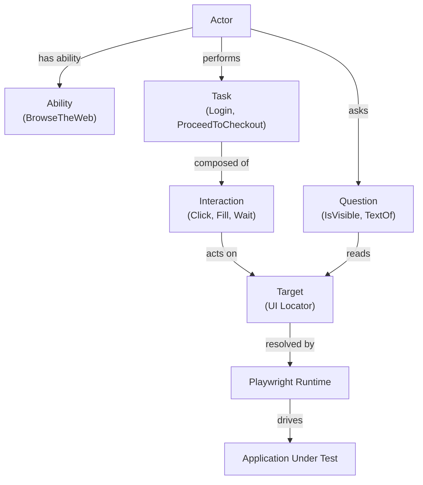

# Playwright + Pytest Screenplay Framework


A production-style UI automation framework built with:

- Python
- Playwright
- Pytest
- Screenplay Pattern

This repository demonstrates how the **Screenplay Pattern** can be implemented in Python
to build maintainable and scalable UI automation frameworks that support both
**BDD (`pytest-bdd`) and direct pytest tests**.

The Screenplay Pattern models tests as interactions between **actors** and the system under test.
Actors perform **tasks** composed of **interactions**, while **questions** read system state.

The framework separates:

- behavior specification
- domain vocabulary
- automation mechanics
- browser runtime

---

## Key Concepts

| Concept | Description |
|---|---|
| Actor | Represents a user interacting with the system |
| Task | A business-level action performed by the actor |
| Interaction | A low-level UI operation |
| Question | Reads information from the application |
| Target | Encapsulates a UI locator |
| Ability | Gives the actor the capability to interact with external systems |

Example execution flow:

Actor -> Task -> Interaction -> Playwright -> Browser

---

## Screenplay Pattern Overview



---

## Example Screenplay Test

```python
def test_login(customer):

    customer.attempts_to(
        Login.with_credentials("standard_user", "secret_sauce")
    )

    assert customer.asks_for(OnInventoryPage())
```

---

## Quick Start

### Windows

```powershell
git clone https://github.com/stansiris/playwright-pytest-screenplay-framework.git
cd playwright-pytest-screenplay-framework

python -m venv .venv
.venv\Scripts\Activate.ps1
pip install -e ".[dev]"
playwright install

pytest -q
```

### macOS / Linux

```bash
git clone https://github.com/stansiris/playwright-pytest-screenplay-framework.git
cd playwright-pytest-screenplay-framework

python -m venv .venv
source .venv/bin/activate
pip install -e ".[dev]"
playwright install

pytest -q
```

---

## Screenplay Abstraction Chain

Actor -> Task -> Interaction -> Target -> Playwright

---

## Framework Layers

| Layer | Purpose | Examples |
|---|---|---|
| Tests | Behavior scenarios | `test_login.py` |
| Domain Layer | Business vocabulary | `Login`, `Checkout` |
| Screenplay Core | Automation primitives | `Actor`, `Task`, `Interaction` |
| Integration | Connects external systems | `BrowseTheWeb` |
| Runtime | Executes browser automation | Playwright |

---

## Framework Architecture

Tests -> Domain Layer -> Screenplay Core -> Playwright

---

## Execution Flow

Test -> Actor -> Task -> Interaction -> Target -> Playwright

---

## Design Principles

### Behavior First
Tests describe **user behavior**, not browser mechanics.

### Intent Over Implementation
Tasks represent **what the user does**.

### Thin Tests
Tests remain minimal and delegate work to reusable domain logic.

### Domain Vocabulary
Automation reflects **business language**, not UI mechanics.

### Single Responsibility
Each abstraction has a focused purpose.

---

## Targets

Targets encapsulate UI locator strategies and allow interactions
to remain independent from the underlying automation framework.

---

## Actor Abilities

```python
customer = Actor("Customer").can(
    BrowseTheWeb.using(page)
)
```

---

## Project Structure

```
screenplay_core/
    abilities/
    core/
    interactions/
    questions/

saucedemo/
    tasks/
    questions/
    ui/

tests/
    features/
    test_*.py

docs/
```

---

## CI Pipeline

GitHub Actions provides:

- Ruff linting
- Black formatting checks
- automated test execution

---

## Runtime Configuration

```
pytest -q --browser=firefox --headed
```

---

## Architecture Decision: Screenplay vs Page Object Model

Decision: Use the **Screenplay Pattern** rather than traditional Page Object Model.

Advantages:

- clearer domain vocabulary
- scalable framework structure
- improved test readability
- better separation of concerns

Trade-offs:

- slightly more framework structure
- requires understanding Screenplay abstractions

---

## What This Framework Demonstrates

This project demonstrates:

- Screenplay Pattern implementation in Python
- Playwright UI automation
- scalable test framework architecture
- domain-driven automation design
- CI integration

---

## Portfolio Context

This repository demonstrates:

- automation architecture design
- Screenplay pattern implementation
- Playwright integration
- CI pipelines
