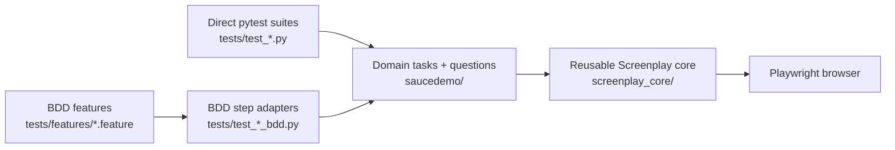

# Playwright + Pytest Screenplay Framework

[](https://github.com/stansiris/playwright-pytest-screenplay-framework/actions/workflows/ci.yml)
[](https://www.python.org/)

A Python UI automation framework using Playwright, pytest, and the Screenplay pattern,
with `pytest-bdd` as the primary behavior layer.

## Portfolio Project

**This repository is a public portfolio showcase project.**
It is intentionally designed to demonstrate end-to-end test automation engineering for recruiters and hiring teams.

This project highlights:
- a maintainable Screenplay-based architecture for UI testing
- reusable `screenplay_core` components with a separate `saucedemo` domain layer
- Codex-assisted implementation with human review and quality ownership
- business-readable BDD scenarios with concise step definitions
- support for both BDD and direct pytest styles on the same model
- marker-driven CI lanes (`smoke`, `integration`, `ui`, `e2e`) with artifacts
- centralized runtime configuration for project execution

## AI-Assisted Development

Most implementation artifacts in this repository were generated with Codex through iterative, conversational prompting by the project author, including both automation code and BDD feature files.

Final architecture, review decisions, and quality gates (lint/format/tests) were performed by the project author.

## Current Test Coverage

Current coverage includes both BDD and direct pytest modules:
- BDD flows:
  - end-to-end smoke flow: `tests/features/golden_path.feature` -> `tests/test_golden_path_bdd.py`
  - login behavior mirror flow: `tests/features/login.feature` -> `tests/test_login_bdd.py`
- direct pytest + Screenplay integration tests:
  - `tests/test_login.py`
  - `tests/test_inventory.py`
  - `tests/test_product_details.py`
  - `tests/test_checkout_info.py`
  - `tests/test_checkout_complete.py`
- UI presentation checks for each core page:
  - `tests/test_ui_pages.py`

## Setup

Use the shell block that matches your environment.

### PowerShell (Windows)

```powershell
python -m venv .venv
.venv\Scripts\Activate.ps1
python -m pip install --upgrade pip
python -m pip install -e ".[dev]"
python -m playwright install
pytest -q
```

### Bash (macOS/Linux)

```bash
python -m venv .venv
source .venv/bin/activate
python -m pip install --upgrade pip
python -m pip install -e ".[dev]"
python -m playwright install
pytest -q
```

## Quick Run Commands

```powershell
# smoke + e2e happy path
pytest -q -m "smoke or e2e"

# integration core (excluding smoke and ui overlap)
pytest -q -m "integration and not smoke and not ui"

# ui-focused page checks
pytest -q -m "ui"

# full regression marker union (keep `ui` explicit for future marker strategy changes)
pytest -q -m "smoke or integration or e2e or ui"
```

## Architecture At A Glance



## CI-Ready Formatting

CI validates code style before running tests:
- `python -m ruff check .`
- `python -m black --check .`

Use these locally before pushing:

```powershell
python -m ruff check .
python -m black .
```

If you want the same validation behavior as CI without modifying files:

```powershell
python -m ruff check .
python -m black --check .
```

## CI Pipeline

GitHub Actions workflow: `.github/workflows/ci.yml`

Trigger model:
- `push`/`pull_request`: fast developer feedback
- `schedule`: unattended confidence runs
- `workflow_dispatch`: manual run

Current CI jobs:
- `lint`: `ruff` + `black --check`
- `tests_fast` (PR/push): `pytest -q -m "smoke or integration or e2e or ui"` on `ubuntu-latest` + `chromium`
- `full_matrix_regression` (schedule/manual): `pytest -q -m "smoke or integration or e2e or ui"` on `ubuntu/windows` x `chromium/firefox`

Marker-based pytest commands are shell-agnostic; only environment variable syntax differs by shell.

Scheduled runs (UTC):
- Weekday nightly: `0 2 * * 1-5`
- Weekly full run: `0 3 * * 0`

## Test Reporting

Pytest generates test artifacts automatically into `test-results/`:
- `junit.xml` for CI parsing/integrations
- `report.html` as a shareable HTML report
- failure screenshots (`--screenshot=only-on-failure`)
- Playwright traces on failures (`--tracing=retain-on-failure`)

In GitHub Actions, `test-results/` is uploaded as a workflow artifact even when tests fail.
Retention policy:
- PR/push jobs: 14 days
- scheduled/manual full regression: 30 days

## Runtime Configuration

Runtime settings are environment-driven through `saucedemo/config/runtime.py`.

| Variable | Default | Description |
| --- | --- | --- |
| `BASE_URL` | `https://www.saucedemo.com/` | Application base URL used by `OpenSauceDemo`/`OpenLoginPage` navigation tasks. |
| `BROWSER` | `chromium` | Default browser for pytest-playwright (`chromium`, `firefox`, `webkit`). |
| `HEADED` | `false` | Run tests headed when true (`true/false`, `1/0`, `yes/no`). |
| `SLOW_MO_MS` | `0` | Slow motion delay in milliseconds for browser actions. |
| `DEFAULT_TIMEOUT_MS` | `5000` | Default timeout for waits and Playwright `expect(...)` assertions. Reusable core also supports `SCREENPLAY_DEFAULT_TIMEOUT_MS` (takes precedence if set). |

### Runtime Example (PowerShell)

```powershell
$env:BASE_URL = "https://www.saucedemo.com"
$env:BROWSER = "firefox"
$env:HEADED = "true"
$env:SLOW_MO_MS = "150"
$env:DEFAULT_TIMEOUT_MS = "7000"
$env:SCREENPLAY_DEFAULT_TIMEOUT_MS = "7000"
pytest -q
```

### Runtime Example (Bash)

```bash
export BASE_URL="https://www.saucedemo.com"
export BROWSER="firefox"
export HEADED="true"
export SLOW_MO_MS="150"
export DEFAULT_TIMEOUT_MS="7000"
export SCREENPLAY_DEFAULT_TIMEOUT_MS="7000"
pytest -q
```

## Hybrid Assertion Model

The framework intentionally supports a hybrid style:
- Playwright-native locator assertions through `Actor.expect(Target)` for strong UI synchronization and readable assertions.
- Screenplay Questions through `Actor.asks_for(...)` for domain/state assertions and reusable business checks.

Example:

```python
customer.expect(SauceDemo.LOGIN_BUTTON).to_be_visible()
customer.expect(SauceDemo.CHECKOUT_TOTAL).to_contain_text("Total:")
customer.expect(SauceDemo.CHECKOUT_TOTAL).to_have_text("Total: $60.45", timeout=3000)
assert customer.asks_for(OnInventoryPage())
```

Timeout behavior:
- default `expect(...)` timeout is set from runtime in `tests/conftest.py`
- pass `timeout=...` on any Playwright assertion call to override per assertion

## API and Design References

Detailed component model, task/question vocabulary, and architecture decisions are documented in:
- `docs/domain_model.md`
- `docs/architecture.md` (layered architecture, class hierarchy diagrams, dependency graphs, runtime sequence diagrams)
- `docs/design_decisions.md`

## Project Structure

```text
screenplay_core/
|-- abilities/      # Reusable abilities (BrowseTheWeb)
|-- core/           # Actor, Task, Interaction, Question, Target
|-- interactions/   # Reusable low-level browser interactions
`-- questions/      # Reusable generic questions

saucedemo/
|-- config/         # Project runtime settings (env-driven)
|-- tasks/          # SauceDemo business-level actions
|-- questions/      # SauceDemo-specific queries
`-- ui/             # SauceDemo locators/targets

tests/
|-- features/       # Gherkin scenarios
|-- conftest.py     # fixture wiring + runtime defaults
`-- test_*.py       # BDD step adapters and direct pytest + Screenplay tests

docs/
|-- architecture.md
|-- codex_workflow.md
|-- design_decisions.md
|-- domain_model.md
`-- engine_flows.md
```

## Test Modes

### 1. pytest-bdd + Screenplay (primary)
- Gherkin defines behavior.
- Step definitions (in `tests/test_golden_path_bdd.py` and `tests/test_login_bdd.py`) map phrases to Tasks/Questions.
- Business intent stays separate from UI mechanics.

### 2. Direct pytest + Screenplay (supported)
- Useful for focused workflow tests and refactoring safety.
- Current examples: `tests/test_login.py`, `tests/test_inventory.py`, `tests/test_product_details.py`, `tests/test_checkout_info.py`, `tests/test_checkout_complete.py`, and `tests/test_ui_pages.py`.

## Documentation

- Domain model: `docs/domain_model.md`
- Architecture: `docs/architecture.md`
- Composed engine flows: `docs/engine_flows.md`
- Design rationale: `docs/design_decisions.md`
- Codex generation workflow: `docs/codex_workflow.md`
