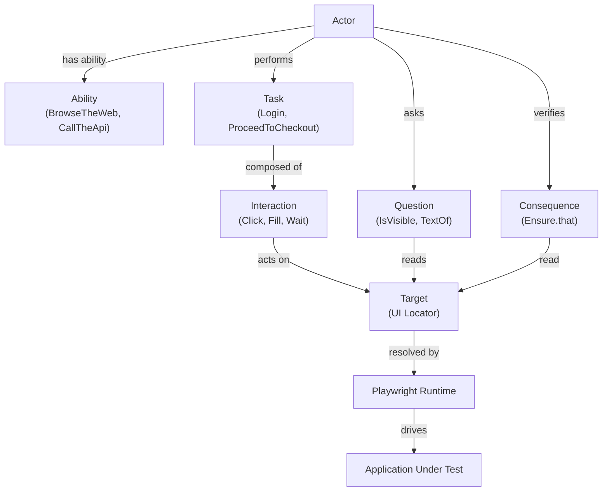

# Playwright + Pytest Screenplay Framework


A production-style UI automation framework built with:

- Python
- Playwright
- Pytest
- Screenplay Pattern

This repo now includes two demo application targets:

- **SauceDemo** (external public app)
- **TaskHub** (bundled local Flask app under `taskhub/`)

TaskHub is intentionally included as an **app-under-test** to demonstrate stable local UI, API,
and hybrid automation scenarios without depending on an external service.

This repository demonstrates how the **Screenplay Pattern** can be implemented in Python
to build maintainable and scalable UI automation frameworks that support both
**BDD (`pytest-bdd`) and direct pytest tests**.

This project is primarily a **framework architecture demonstration** rather than a large
test suite. The goal is to illustrate how Screenplay concepts can be implemented in Python
while leveraging Playwright's modern automation capabilities.

---

# Quick Start

### Windows

```powershell
git clone https://github.com/stansiris/playwright-pytest-screenplay-framework.git
cd playwright-pytest-screenplay-framework

python -m venv .venv
.venv\Scripts\Activate.ps1
pip install -e ".[dev]"
playwright install

pytest -q
```

### macOS / Linux

```bash
git clone https://github.com/stansiris/playwright-pytest-screenplay-framework.git
cd playwright-pytest-screenplay-framework

python -m venv .venv
source .venv/bin/activate
pip install -e ".[dev]"
playwright install

pytest -q
```

---

# Key Concepts

| Concept | Description |
|---|---|
| Actor | Represents a user interacting with the system and orchestrates actions. |
| Ability | Grants the actor the capability to interact with external systems (e.g., `BrowseTheWeb`, `CallTheApi`). |
| Task | A high-level business action performed by the actor (e.g., `Login`, `Checkout`). |
| Interaction | A low-level operation that performs a single UI action (e.g., `Click`, `Fill`). |
| Target | Encapsulates a UI locator and resolves it for the actor. |
| Question | Retrieves information from the system under test. |
| Consequence | Verifies system state, typically using assertions (e.g., `Ensure`). |

---

# TaskHub Demo App

## What TaskHub Is

TaskHub is a lightweight Flask + sqlite task management app bundled in this repository.
It exists to showcase how this framework can automate:

- UI flows with Playwright + Screenplay Tasks/Questions
- JSON API flows
- Hybrid flows (create in API, verify in UI and vice versa)

## Where TaskHub Lives

- App: `taskhub/app/`
- TaskHub automation layer: `taskhub/automation/`
- TaskHub tests: `tests/taskhub/`

## Default Credentials

- Username: `admin`
- Password: `admin123`

## Run TaskHub Locally

### Windows

```powershell
python -m venv .venv
.venv\Scripts\Activate.ps1
pip install -e ".[dev]"
playwright install

python -m taskhub.app.app
```

### macOS / Linux

```bash
python -m venv .venv
source .venv/bin/activate
pip install -e ".[dev]"
playwright install

python -m taskhub.app.app
```

TaskHub default URL: `http://127.0.0.1:5001/`

## Run TaskHub Tests

UI, API, and hybrid suites are under `tests/taskhub/`.

```bash
pytest tests/taskhub -q
```

Run only UI:

```bash
pytest tests/taskhub/test_taskhub_ui.py -q
```

Run only API:

```bash
pytest tests/taskhub/test_taskhub_api.py -q
```

Run only hybrid:

```bash
pytest tests/taskhub/test_taskhub_hybrid.py -q
```

`tests/taskhub/conftest.py` starts a local TaskHub server automatically for test execution.

---

## Framework Screenplay Pattern Overview



---

# Assertion Model

A key feature of this framework is that it gives developers access to [Playwright's powerful assertion methods](https://playwright.dev/python/docs/test-assertions) without exposing the raw `expect()` function directly in test code.

This is done through `Ensure`, a Screenplay-style assertion wrapper around Playwright's `expect()` API.

`Ensure` provides a thin DSL that allows Playwright locator assertions to be used as Screenplay Consequences.

Example:

    actor.attempts_to(
        Ensure.that(LoginPage.ERROR_MESSAGE).to_be_visible()
    )

## Design overview

A Playwright assertion normally looks like this:

    expect(locator).to_be_visible()

In the Screenplay pattern, test behavior is expressed through activities performed by an Actor. Assertions therefore need to be represented as Screenplay objects that the actor can execute.

`Ensure` bridges these two models by dynamically forwarding Playwright assertion methods into Screenplay Consequences.

This design has several advantages:

- keeps Playwright assertion methods available
- avoids writing wrappers for every assertion method
- preserves Screenplay semantics (the Actor performs Consequences)
- keeps the DSL clean and expressive

Type casting to `LocatorAssertions` is used to enable IDE auto-completion for Playwright assertion methods while still using dynamic forwarding internally.

---

# Example Screenplay Test

```python
@pytest.mark.parametrize(
    "username,password",
    [
        ("standard_user", "secret_sauce"),
        ("problem_user", "secret_sauce"),
        ("performance_glitch_user", "secret_sauce"),
    ],
)
def test_successful_login(customer, username, password) -> None:
    """Verify valid users can log in, reach inventory, and then log out back to login page."""
    customer.attempts_to(
        OpenSauceDemo.app(), #Open the SauceDemo app URL
        Ensure.that(LoginPage.LOGIN_BUTTON).to_be_visible(), #Assert login page is ready
        Login.with_credentials(username=username, password=password), #Enter valid credentials and click login
        Ensure.that(InventoryPage.INVENTORY_CONTAINER).to_be_visible(), #Assert that we see the inventory page
        Logout(), #Open the menu and click logout
        Ensure.that(LoginPage.LOGIN_BUTTON).to_be_visible(), #Assert that we are back on the login page by checking that the login button is visible
    )
```

---

# Framework Architecture

The framework separates responsibilities into clear architectural layers.
Each layer interacts only with adjacent layers, improving maintainability and reuse.

| Layer | Purpose | Examples |
|---|---|---|
| Tests | Behavior scenarios orchestrating actions | `test_login.py` |
| Domain Layer | Business vocabulary and behavior | `Login`, `Checkout`, `TextOf` |
| Screenplay Core | Actor behavior primitives | `Actor`, `Task`, `Interaction`, `Question`, `Consequence` |
| UI Abstractions | Encapsulates UI elements | `Target` |
| Integration | Actor abilities connecting to external systems | `BrowseTheWeb`, `CallTheApi` |
| Automation Engine | Executes browser automation | Playwright |

#### For a detailed explanation of the framework, see [docs/architecture.md](docs/architecture.md).</br>
#### For a detailed explanation of the design decisions, see [docs/design_decisions.md](docs/design_decisions.md).</br>
#### For a step-by-step first test walkthrough, see [docs/get_started.md](docs/get_started.md).

---

# Project Structure

```
screenplay_core/
    abilities/
    core/
    interactions/
    questions/
    consequences/

saucedemo/
    tasks/
    questions/
    ui/

taskhub/
    app/
    automation/

tests/
    features/
    taskhub/
    test_*.py

docs/
    *.md
```

---

# How to Explore This Repository

A good way to understand the framework is to read the code in the following order.

1. `tests/test_login.py`  
   Start here to see the smallest complete Screenplay test using the framework.

2. `screenplay_core/core/actor.py`  
   Read this next to understand how the actor executes tasks, consequences, and questions.

3. `saucedemo/tasks/login.py`  
   This shows how domain behavior is modeled as a reusable Screenplay task.

4. `screenplay_core/consequences/ensure.py`  
   This file demonstrates how Playwright assertions are exposed through the Screenplay DSL.

---

# CI Pipeline

GitHub Actions is used for:

- Ruff linting
- Black formatting checks
- Automated test execution
- Artifact uploads to support debugging failed runs

---

# Portfolio Context

This repository illustrates:

- practical automation framework architecture in Python
- Screenplay pattern implementation with clear layer boundaries
- Playwright integration with readable business-flow tests (`Task`/`Consequence`)
- a custom assertion DSL (`Ensure`) that preserves Playwright assertion power
- support for both pytest and pytest-bdd test styles
- maintainable automation design with CI quality gates (lint, format, tests)

