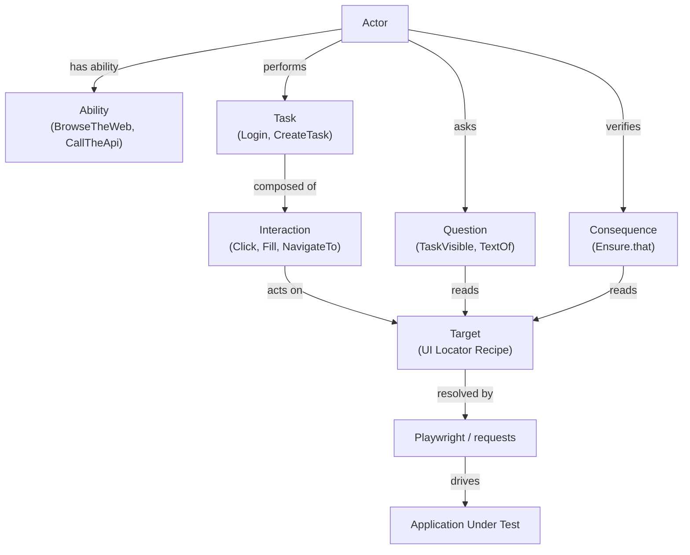

# Playwright + Pytest Screenplay Framework


A production-style test automation framework built with Python, Playwright, Pytest, and the
**Screenplay Pattern**. The repository ships two fully working example targets on top of a
reusable Screenplay core:

- **SauceDemo** — external public e-commerce app (UI + BDD)
- **TaskHub** — bundled Flask app (UI, JSON API, and hybrid cross-boundary tests)

The primary goal is to demonstrate how the Screenplay Pattern can be implemented in Python
to produce readable, layered, and maintainable automation — not to be a large test suite.

---

## Quick Start

### Windows

```powershell
git clone https://github.com/stansiris/playwright-pytest-screenplay-framework.git
cd playwright-pytest-screenplay-framework

python -m venv .venv
.venv\Scripts\Activate.ps1
pip install -e ".[dev]"
playwright install

pytest -q
```

### macOS / Linux

```bash
git clone https://github.com/stansiris/playwright-pytest-screenplay-framework.git
cd playwright-pytest-screenplay-framework

python -m venv .venv
source .venv/bin/activate
pip install -e ".[dev]"
playwright install

pytest -q
```

---

## Key Concepts

| Concept | Description |
|---|---|
| Actor | Represents a user; orchestrates all actions and questions. |
| Ability | Grants the actor capability to reach an external system (`BrowseTheWeb`, `CallTheApi`). |
| Task | A high-level business action composed of interactions (`Login`, `CreateTask`). |
| Interaction | A single low-level browser operation (`Click`, `Fill`, `NavigateTo`). |
| Target | A named, lazy locator recipe resolved through the actor's `BrowseTheWeb` ability. |
| Question | Reads and returns information from the system under test. |
| Consequence | Verifies system state; wraps Playwright `expect()` assertions (`Ensure`). |

---

## Architecture

The framework is a strict 4-layer stack. Each layer depends only on the layer below it.

```
Tests               →  describe behavior (thin, no browser details)
Example Target Layer →  app-specific Tasks, Questions, Targets, API tasks
Screenplay Core      →  Actor, Task, Interaction, Question, Target, Ensure
Playwright / requests →  browser and HTTP execution
```



---

## Assertion Model

`Ensure` is a Screenplay-style DSL that wraps Playwright's `expect()` API. It gives tests
access to Playwright's full locator assertion set — auto-waiting, retry, and strong failure
diagnostics — without exposing `expect()` directly in test code.

```python
# Raw Playwright
expect(page.locator("#inventory_container")).to_be_visible()

# Screenplay equivalent
actor.attempts_to(
    Ensure.that(InventoryPage.INVENTORY_CONTAINER).to_be_visible()
)
```

`Ensure.that(target)` returns a `Consequence` object. The actor executes it, resolves the
`Target` into a Playwright `Locator`, and delegates to `expect(locator)`. IDE
autocompletion for all Playwright assertion methods is preserved via a `cast` to
`LocatorAssertions`.

---

## Example Tests

### SauceDemo — UI test with parametrize

```python
@pytest.mark.parametrize(
    "username,password",
    [
        ("standard_user", "secret_sauce"),
        ("problem_user", "secret_sauce"),
        ("performance_glitch_user", "secret_sauce"),
    ],
)
@pytest.mark.smoke
def test_successful_login(customer, username, password) -> None:
    customer.attempts_to(
        OpenSauceDemo.app(),
        Ensure.that(LoginPage.LOGIN_BUTTON).to_be_visible(),
        Login.with_credentials(username=username, password=password),
        Ensure.that(InventoryPage.INVENTORY_CONTAINER).to_be_visible(),
        Logout(),
        Ensure.that(LoginPage.LOGIN_BUTTON).to_be_visible(),
    )
```

### TaskHub — hybrid test (create via API, verify in UI)

```python
@pytest.mark.hybrid
def test_create_task_via_api_verify_in_ui(taskhub_api_actor, taskhub_customer) -> None:
    title = "Hybrid API to UI task"
    create_task = CreateTaskViaApi.with_payload(
        {"title": title, "description": "Created via API", "priority": "HIGH"}
    )
    taskhub_api_actor.attempts_to(
        LoginToTaskHubApi.with_credentials("admin", "admin123"),
        create_task,
    )
    assert create_task.result.status_code == 201

    taskhub_customer.attempts_to(
        OpenTaskHub.app(),
        LoginToTaskHub.with_credentials("admin", "admin123"),
        Ensure.that(TaskHubTargets.task_item_for_id(create_task.task_id)).to_be_visible(),
        Ensure.that(TaskHubTargets.task_title_text_for_id(create_task.task_id)).to_have_text(title),
    )
```

---

## SauceDemo

An external public e-commerce demo app used to show UI automation and BDD.

- Automation layer: `examples/saucedemo/`
- Tests: `tests/saucedemo/`
- BDD feature files: `tests/saucedemo/features/`

```bash
pytest tests/saucedemo -q
```

---

## TaskHub

A lightweight Flask + SQLite task management app bundled in this repository. It exists so
the framework can demonstrate UI, API, and hybrid automation without any external dependency.

### Where it lives

| Path | Purpose |
|---|---|
| `examples/taskhub/app/` | Flask app source (routes, db, seed data) |
| `examples/taskhub/automation/` | Tasks, Questions, Targets, API client |
| `tests/taskhub/` | UI, API, and hybrid test suites |

### Default credentials

- Username: `admin`
- Password: `admin123`

### Run locally

```bash
python -m examples.taskhub.app.app
# → http://127.0.0.1:5001/
```

### Run the tests

`tests/taskhub/conftest.py` starts a TaskHub server automatically on a free port for each
test session. No manual server start needed.

```bash
pytest tests/taskhub -q                          # all TaskHub tests
pytest tests/taskhub/test_taskhub_ui.py -q       # UI only
pytest tests/taskhub/test_taskhub_api.py -q      # API only
pytest tests/taskhub/test_taskhub_hybrid.py -q   # hybrid only
```

### Test markers

| Marker | Scope |
|---|---|
| `smoke` | Critical happy-path scenarios |
| `ui` | UI presentation and interaction |
| `api` | API-only scenarios |
| `hybrid` | Cross UI–API boundary scenarios |
| `integration` | Cross-component integration |
| `e2e` | Full end-to-end flows |

```bash
pytest -m "smoke or api" -q
```

---

## Project Structure

```
screenplay_core/
    abilities/          # BrowseTheWeb, CallTheApi
    core/               # Actor, Task, Interaction, Question, Target
    interactions/       # Click, Fill, NavigateTo, …
    questions/          # TextOf, CurrentUrl, IsVisible, …
    consequences/       # Ensure (Playwright expect() DSL)

examples/
    saucedemo/
        tasks/          # Login, Logout, AddProductToCart, …
        questions/      # OnInventoryPage, TotalsMatchComputedSum, …
        ui/
            pages/      # LoginPage, InventoryPage, CartPage, …
            components/ # AppShell, BackNavigation
    taskhub/
        app/            # Flask app, db, seed
        automation/
            tasks/      # LoginToTaskHub, CreateTask, EditTask, …
            questions/  # TaskVisible, TaskCompleted, FlashMessages, …
            ui/         # TaskHubTargets (all data-testid selectors)
            api/        # TaskHubApiClient

tests/
    conftest.py         # Browser launch option overrides
    saucedemo/
        conftest.py     # customer actor fixture, base URL
        features/       # Gherkin feature files (pytest-bdd)
        test_*.py       # Direct pytest + BDD suites
    taskhub/
        conftest.py     # Server lifecycle, per-test reset, actor fixtures
        test_*.py       # UI, API, hybrid suites

docs/
    architecture.md     # Class hierarchy, dependency map, runtime sequences
    design_decisions.md # Q&A on key architectural choices
    get_started.md      # Step-by-step guide: write your first test
```

---

## How to Explore the Code

A good reading order for understanding the framework end to end:

1. [`tests/saucedemo/test_login.py`](tests/saucedemo/test_login.py) — smallest complete Screenplay test
2. [`screenplay_core/core/actor.py`](screenplay_core/core/actor.py) — how the actor executes tasks, consequences, and questions
3. [`examples/saucedemo/tasks/login.py`](examples/saucedemo/tasks/login.py) — domain behavior modeled as a reusable Task
4. [`screenplay_core/consequences/ensure.py`](screenplay_core/consequences/ensure.py) — how Playwright assertions are exposed through the Screenplay DSL
5. [`tests/taskhub/test_taskhub_hybrid.py`](tests/taskhub/test_taskhub_hybrid.py) — cross-boundary test using both `BrowseTheWeb` and `CallTheApi`

---

## CI Pipeline

GitHub Actions runs on push, pull request, and a nightly schedule.

| Job | Trigger | What it does |
|---|---|---|
| `lint` | push / PR | ruff check + black format check |
| `tests_fast` | push / PR | full marker union on Ubuntu / Chromium |
| `full_matrix_regression` | schedule / manual | Ubuntu + Windows × Chromium + Firefox |

Test artifacts (screenshots, traces, HTML report, JUnit XML) are uploaded on failure.

---

## Further Reading

- [docs/architecture.md](docs/architecture.md) — full class hierarchy and runtime sequence diagrams
- [docs/design_decisions.md](docs/design_decisions.md) — why Screenplay over Page Object Model, and other key choices
- [docs/get_started.md](docs/get_started.md) — step-by-step: write and run your first test

---

## Portfolio Context

This repository demonstrates:

- Screenplay Pattern implementation in Python with clear layer boundaries
- Playwright integration exposed through a custom assertion DSL (`Ensure`)
- Dual-ability actors: `BrowseTheWeb` for UI and `CallTheApi` for JSON APIs
- Cross-boundary (hybrid) testing combining UI and API actors in a single test
- Support for both direct pytest and pytest-bdd test styles
- CI quality gates: lint, format check, and automated test execution
