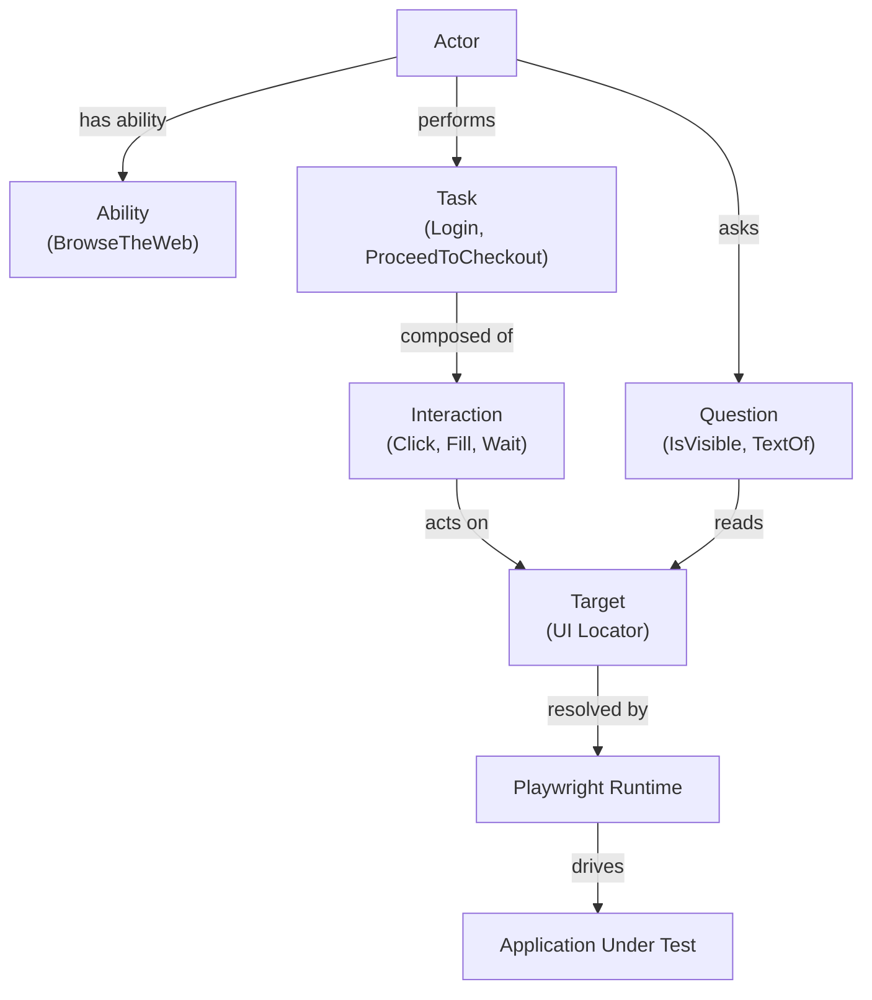

# Playwright + Pytest Screenplay Framework


A production-style UI automation framework built with:

- Python
- Playwright
- Pytest
- Screenplay Pattern

This repository demonstrates how the **Screenplay Pattern** can be implemented in Python
to build maintainable and scalable UI automation frameworks that support both
**BDD (`pytest-bdd`) and direct pytest tests**.

This project is primarily a **framework architecture demonstration** rather than a large
test suite. The goal is to illustrate how Screenplay concepts can be implemented in Python
while leveraging Playwright’s modern automation capabilities.

---

# Quick Start

### Windows

```powershell
git clone https://github.com/stansiris/playwright-pytest-screenplay-framework.git
cd playwright-pytest-screenplay-framework

python -m venv .venv
.venv\Scripts\Activate.ps1
pip install -e ".[dev]"
playwright install

pytest -q
```

### macOS / Linux

```bash
git clone https://github.com/stansiris/playwright-pytest-screenplay-framework.git
cd playwright-pytest-screenplay-framework

python -m venv .venv
source .venv/bin/activate
pip install -e ".[dev]"
playwright install

pytest -q
```

---

# Example Screenplay Test

```python
def test_login(customer):

    customer.attempts_to(
        Login.with_credentials("standard_user", "secret_sauce")
    )

    assert customer.asks_for(OnInventoryPage())
```
This illustrates the Screenplay approach where **actors perform tasks and ask questions**.

---

# Key Concepts

| Concept | Description |
|---|---|
| Actor | Represents a user interacting with the system and orchestrates actions. |
| Ability | Grants the actor the capability to interact with external systems (e.g., `BrowseTheWeb`). |
| Task | A high-level business action performed by the actor (e.g., `Login`, `Checkout`). |
| Interaction | A low-level operation that performs a single UI action (e.g., `Click`, `Fill`). |
| Target | Encapsulates a UI locator and resolves it for the actor. |
| Question | Retrieves information from the system under test. |
| Consequence | Verifies system state, typically using assertions (e.g., `Ensure`). |

Conceptual flow:

Actor → Task → Interaction → Target → Playwright → Application

---

## Screenplay Pattern Overview



---

# Assertion Model

This framework supports **two complementary assertion approaches**.

### UI Assertions (Ensure)

```python
customer.attempts_to(
    Ensure.that(InventoryPage.CONTAINER).to_be_visible(),
    Ensure.that(AppHeader.TITLE).to_have_text("Products"),
)
```

Internally executes:

```
expect(locator).to_be_visible()
```

Advantages:

- Playwright auto-waiting
- retry logic
- strong failure diagnostics

### Value Assertions (Questions)

```python
title = customer.asks_for(TextOf(AppHeader.TITLE))

assert title == "Products"
```

Rule of thumb:

Ensure → UI assertions  
Question → retrieve values  
assert → verify values

See `docs/assertion_model.md` for details.

---

# Framework Architecture

The framework separates responsibilities into clear layers so that tests remain thin,
domain behavior stays reusable, and browser automation details remain isolated.

Tests
↓
Domain Layer (tasks, questions, targets)
↓
Screenplay Core (actor, task, interaction, consequence, ability)
↓
Playwright Runtime
↓
Application Under Test

| Layer | Responsibility |
|---|---|
| Tests | Describe scenarios and orchestrate behavior |
| Domain Layer | Encapsulates application-specific tasks, questions, and targets |
| Screenplay Core | Provides reusable Screenplay abstractions |
| Playwright Runtime | Executes browser interactions and assertions |
| Application Under Test | The system being automated |

For a deeper explanation of framework layers and runtime flow, see [docs/architecture.md](docs/architecture.md).

For implementation rationale and trade-offs, see [docs/design_decisions.md](docs/design_decisions.md).

---

# Framework Layers

The framework separates responsibilities into clear architectural layers.
Each layer interacts only with adjacent layers, improving maintainability and reuse.

| Layer | Purpose | Examples |
|---|---|---|
| Tests | Behavior scenarios orchestrating actions | `test_login.py` |
| Domain Layer | Business vocabulary and behavior | `Login`, `Checkout`, `TextOf` |
| Screenplay Core | Actor behavior primitives | `Actor`, `Task`, `Interaction`, `Question`, `Consequence` |
| UI Abstractions | Encapsulates UI elements | `Target` |
| Integration | Actor abilities connecting to external systems | `BrowseTheWeb` |
| Automation Engine | Executes browser automation | Playwright |

---

# Project Structure

```
screenplay_core/
    abilities/
    core/
    interactions/
    questions/
    consequences/

saucedemo/
    tasks/
    questions/
    ui/

tests/
    features/
    test_*.py

docs/
    getting_started.md
    assertion_model.md
```

---

# How to Explore This Repository

A good way to understand the framework is to read the code in the following order.

1. `tests/test_login.py`  
   Start here to see the smallest complete Screenplay test using the framework.

2. `screenplay_core/core/actor.py`  
   Read this next to understand how the actor executes tasks, consequences, and questions.

3. `saucedemo/tasks/login.py`  
   This shows how domain behavior is modeled as a reusable Screenplay task.

4. `screenplay_core/consequences/ensure.py`  
   This file demonstrates how Playwright assertions are exposed through the Screenplay DSL.

Additional orientation:

- `docs/getting_started.md` — overview of how to navigate the project
- `docs/assertion_model.md` — explanation of `Ensure`, `Question`, and assertion usage

---

# Architecture Decision: Screenplay vs Page Object Model

Decision: Use the **Screenplay Pattern** rather than traditional Page Object Model.

Advantages:

- clearer domain vocabulary
- scalable framework structure
- improved test readability
- better separation of concerns

Trade-offs:

- slightly more framework structure
- requires understanding Screenplay abstractions

---

# CI Pipeline

GitHub Actions provides:

- Ruff linting
- Black formatting checks
- automated test execution

---

# Portfolio Context

This repository illustrates:

- automation framework architecture
- Screenplay pattern implementation
- Playwright integration
- maintainable automation design
