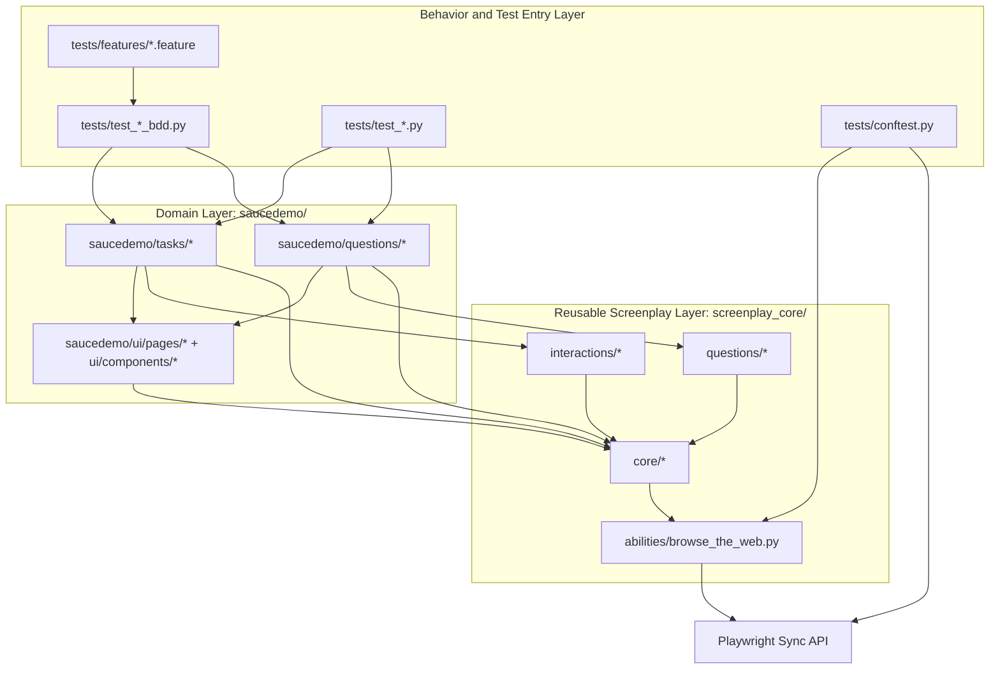
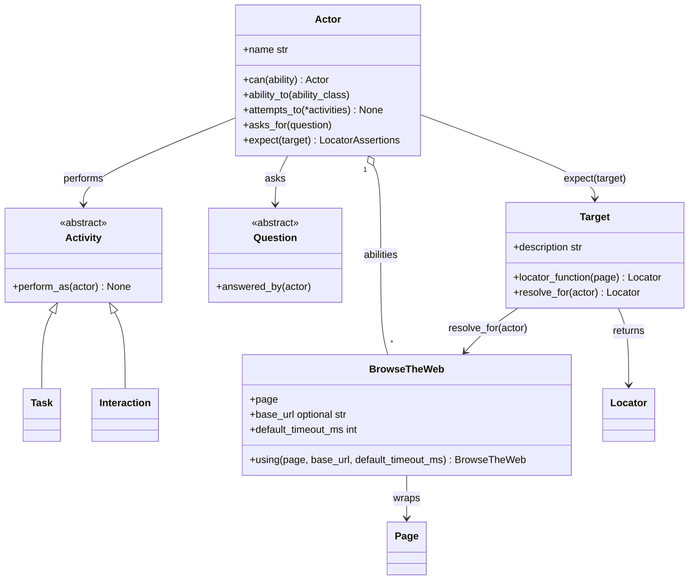
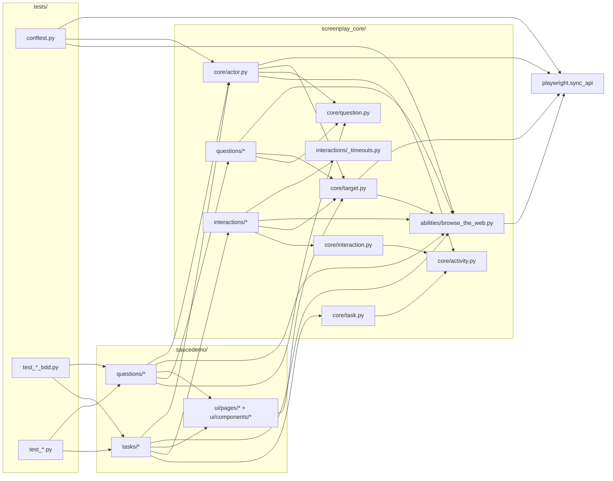
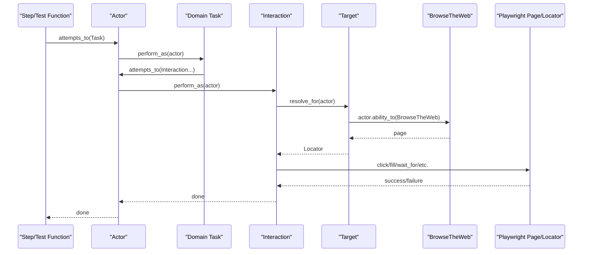
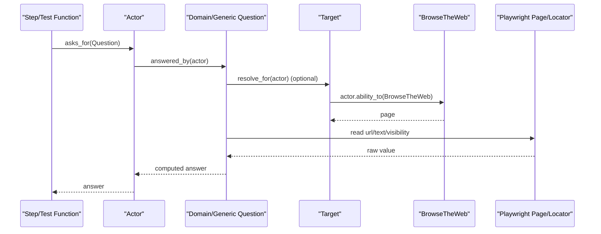

# Framework Architecture (Hierarchy + Dependencies)

This document is a deep-dive architecture map for the framework.
It shows:
- class hierarchy (inheritance model)
- class dependencies (who uses whom)
- runtime execution flow from feature/test to browser

## 1. System Architecture (Layered View)

## 2. Core Class Hierarchy

## 3. Extension Points

For new product domains, the framework extension path is intentionally small:

- define page targets in `yourdomain/ui/pages/*`
- define shared targets in `yourdomain/ui/components/*` when reused across pages
- implement intent-level Tasks in `yourdomain/tasks/*`
- implement domain Questions in `yourdomain/questions/*`
- keep test step files thin and delegate to Tasks/Questions

This keeps business vocabulary domain-specific while preserving the reusable Screenplay core.

## 4. Module Dependency Graph

This graph focuses on import direction and responsibility boundaries.

## 5. Runtime Sequence (How a Step Executes)

### 5.1 Task + Interaction Path

### 5.2 Question Path

## 6. Timeout and Assertion Architecture

Two wait/assertion paths are intentionally supported:

1. Interaction wait path:
- `WaitUntilVisible` / `WaitUntilHidden`
- timeout resolved via `screenplay_core/interactions/_timeouts.py`
- source of default timeout: `BrowseTheWeb.default_timeout_ms`

2. Playwright assertion path:
- `Actor.expect(Target)` returns Playwright locator assertions
- assertion timeout uses Playwright's default unless overridden per assertion
- any assertion can still override timeout explicitly

## 7. Architectural Rules (Current Conventions)

- Steps in `tests/test_*.py` should stay thin and delegate behavior to Tasks/Questions.
- Tasks should express user intent and compose reusable interactions/tasks.
- Questions should read state or compute business checks, then return values.
- Selectors and target factories are organized by page under `saucedemo/ui/pages/*`, with shared controls in `saucedemo/ui/components/*`.
- `Target` resolution must flow through actor ability (`BrowseTheWeb`) to keep browser access centralized.

## 8. Directory-to-Responsibility Map

| Directory | Responsibility |
| --- | --- |
| `screenplay_core/core` | Actor orchestration and base abstractions (`Activity`, `Task`, `Interaction`, `Question`, `Target`). |
| `screenplay_core/abilities` | External system capability wrapper (`BrowseTheWeb`). |
| `screenplay_core/interactions` | Reusable low-level actions against Playwright locators/pages. |
| `screenplay_core/questions` | Generic read-model queries reusable across domains. |
| `saucedemo/ui/pages` | Page-specific target catalogs and dynamic target factories. |
| `saucedemo/ui/components` | Reusable targets shared across multiple pages. |
| `saucedemo/tasks` | Domain intent operations and composed workflows. |
| `saucedemo/questions` | Domain-specific assertions/state checks. |
| `tests/features` | Business-readable behavior specs (Gherkin). |
| `tests/test_*.py` | Thin BDD adapters plus direct pytest + Screenplay suites. |
| `tests/conftest.py` | Runtime wiring: actor fixture, base URL normalization, and browser launch option overrides. |

