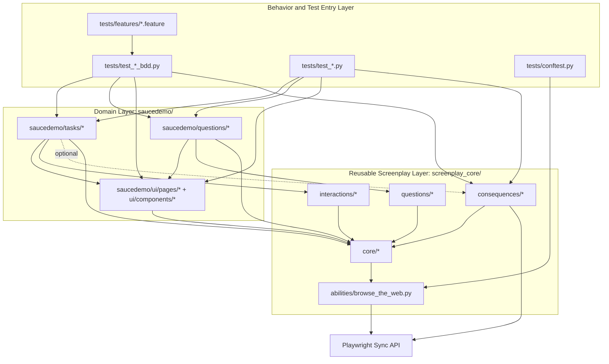
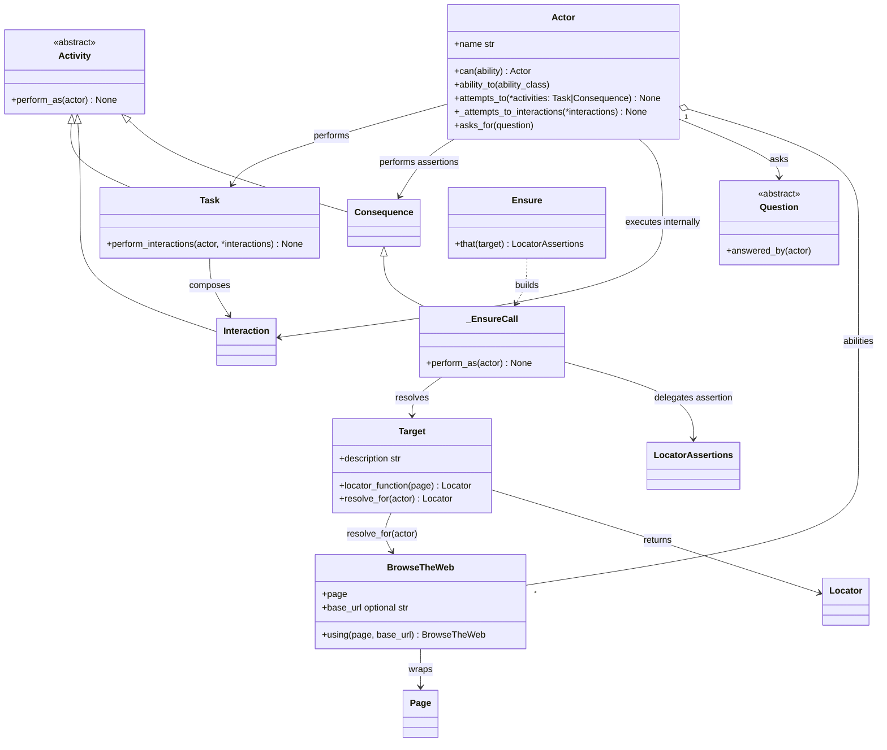
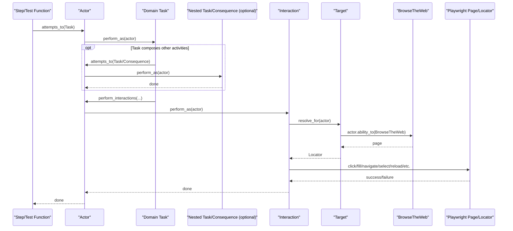
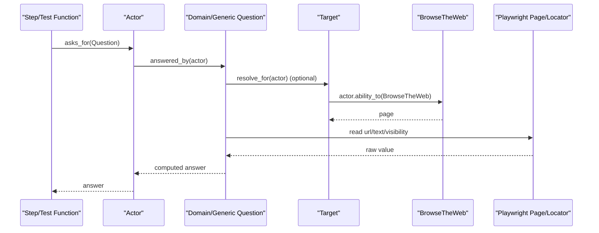
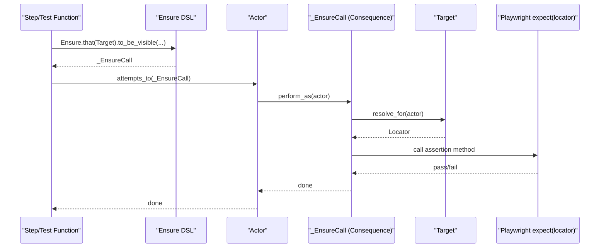

# Framework Architecture (Hierarchy + Dependencies)

This document is a deep-dive architecture map for the framework.
It shows:
- class hierarchy (inheritance model)
- class dependencies (implemented and allowed)
- runtime execution flow from feature/test to browser

## 1. System Architecture (Layered View)

### Plain-English Explanation

- Think of this as a 4-layer stack:
- top layer: test files (`tests/...`) say what should happen
- domain layer: `saucedemo/...` turns that into business actions and questions
- core layer: `screenplay_core/...` provides reusable Screenplay building blocks
- bottom layer: Playwright actually drives the browser
- Most arrows are normal dependencies used every day.
- The dotted arrow from Task to Consequence means this is allowed but optional.

## 2. Core Class Hierarchy

### Plain-English Explanation

- `Actor` is the test user. The actor is the one that does everything.
- `Activity` is the parent type for things the actor can execute.
- `Task` = high-level user action (business intent).
- `Interaction` = low-level browser action (click, fill, navigate, etc.).
- `Consequence` = verification step (assertion), such as `Ensure`.
- `Question` is separate: it asks for data and returns an answer.
- `Target` is a named recipe for finding an element on the page.
- `BrowseTheWeb` gives the actor access to Playwright `page`.
- `CallTheAPI` gives the actor access to HTTP APIs through a shared `requests` session.
- `Ensure` builds `_EnsureCall`, and `_EnsureCall` is the actual assertion activity run by the actor.

## 3. Extension Points

For new product domains, the framework extension path is intentionally small:

- define page targets in `yourdomain/ui/pages/*`
- define shared targets in `yourdomain/ui/components/*` when reused across pages
- implement intent-level Tasks in `yourdomain/tasks/*`
- implement domain Questions in `yourdomain/questions/*`
- keep test step files thin and delegate to Tasks/Questions/Consequences

This keeps business vocabulary domain-specific while preserving the reusable Screenplay core.

## 4. Runtime Sequence (How a Step Executes)

### 4.1 Task + Interaction Path

#### Plain-English Explanation

1. A test step tells the actor to run a Task.
2. That Task can optionally run other Tasks/Consequences.
3. The Task then runs low-level Interactions.
4. Each Interaction resolves a Target into a Playwright Locator through `BrowseTheWeb`.
5. Playwright executes the browser action and returns pass/fail to the test flow.

### 4.2 Question Path

#### Plain-English Explanation

1. A test asks the actor a Question.
2. The Question reads UI state (optionally through a Target).
3. The Question can transform raw UI data into a business answer.
4. The answer is returned to the test for assertion or follow-up logic.

### 4.3 Ensure Consequence Path

#### Plain-English Explanation

1. `Ensure.that(...).to_*()` creates an assertion activity object.
2. The test gives that object to the actor via `attempts_to(...)`.
3. The actor executes it, resolves the Target, and calls Playwright `expect(locator)`.
4. If the assertion passes, flow continues; if it fails, the test fails at this step.

## 5. Architectural Rules (Current Conventions)

- Steps in `tests/test_*.py` should stay thin and delegate behavior to Tasks/Questions/Consequences.
- Tasks should express user intent and compose reusable interactions/tasks.
- Tasks may compose Consequences when workflow-level verification is part of
  the domain behavior.
- Questions should read state or compute business checks, then return values.
- Selectors and target factories are organized by page under `saucedemo/ui/pages/*`, with shared controls in `saucedemo/ui/components/*`.
- `Target` resolution must flow through actor ability (`BrowseTheWeb`) to keep browser access centralized.

## 6. Directory-to-Responsibility Map

| Directory | Responsibility |
| --- | --- |
| `screenplay_core/core` | Actor orchestration and base abstractions (`Activity`, `Task`, `Interaction`, `Question`, `Target`). |
| `screenplay_core/abilities` | External system capability wrappers (`BrowseTheWeb`, `CallTheAPI`). |
| `screenplay_core/interactions` | Reusable low-level actions against Playwright locators/pages. |
| `screenplay_core/questions` | Generic read-model queries reusable across domains. |
| `screenplay_core/consequences` | Assertion adapters that expose Playwright `expect(...)` as Screenplay `Consequence`s. |
| `saucedemo/ui/pages` | Page-specific target catalogs and dynamic target factories. |
| `saucedemo/ui/components` | Reusable targets shared across multiple pages. |
| `saucedemo/tasks` | Domain intent operations and composed workflows. |
| `saucedemo/questions` | Domain-specific assertions/state checks. |
| `tests/features` | Business-readable behavior specs (Gherkin). |
| `tests/test_*.py` | Thin BDD adapters plus direct pytest + Screenplay suites. |
| `tests/conftest.py` | Runtime wiring: actor fixture, base URL normalization, and browser launch option overrides. |

