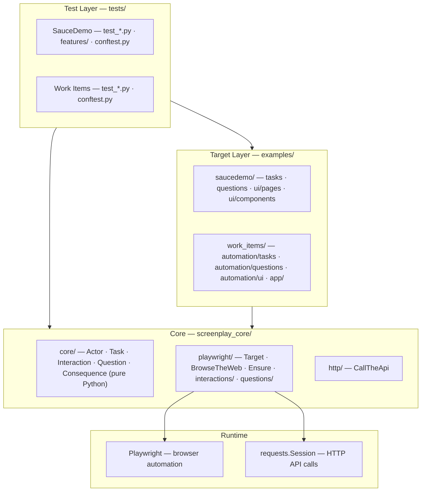
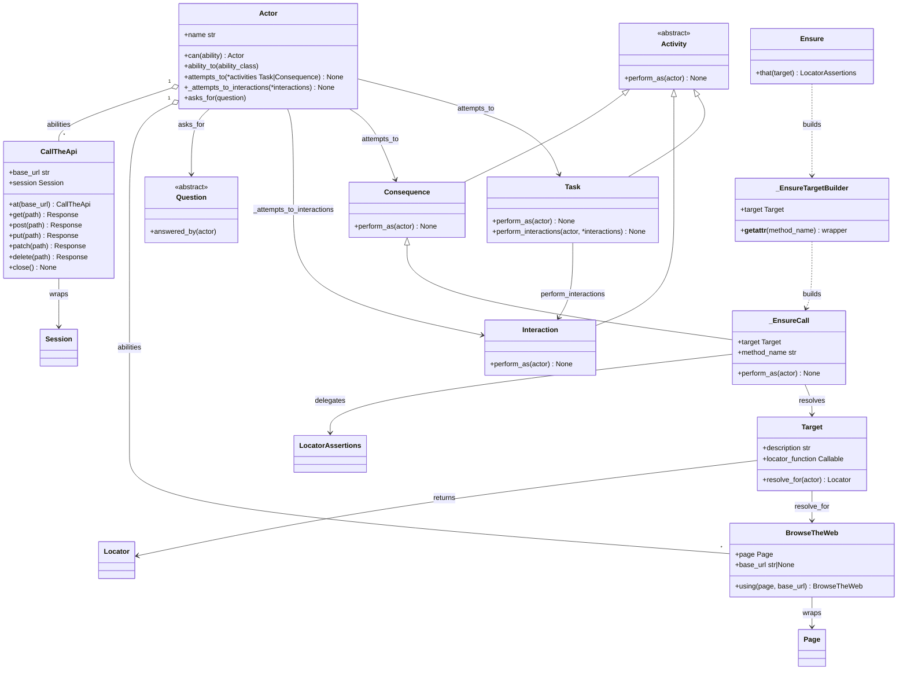
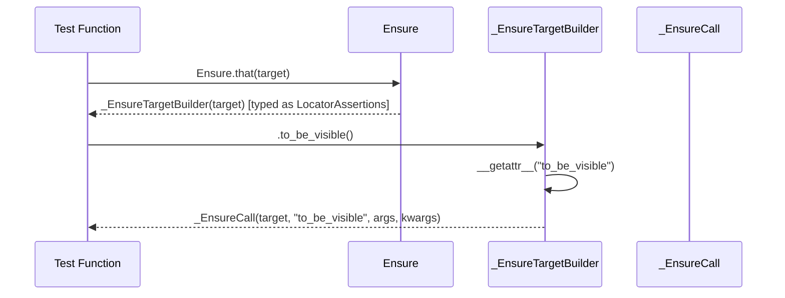
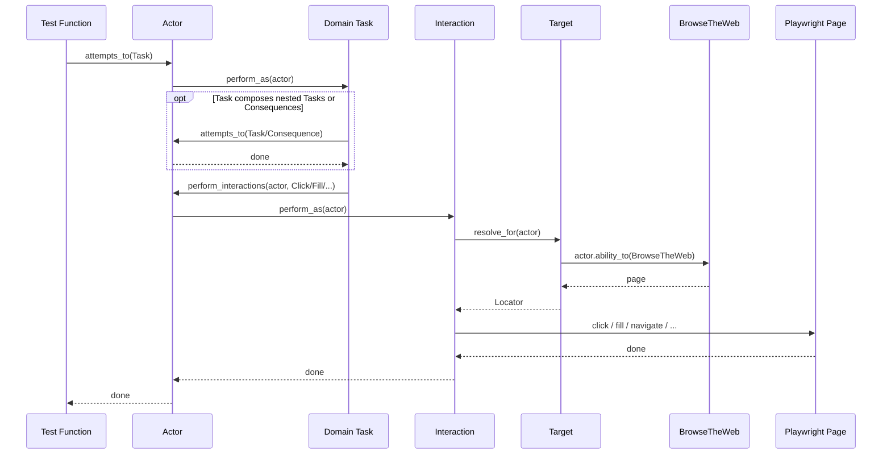
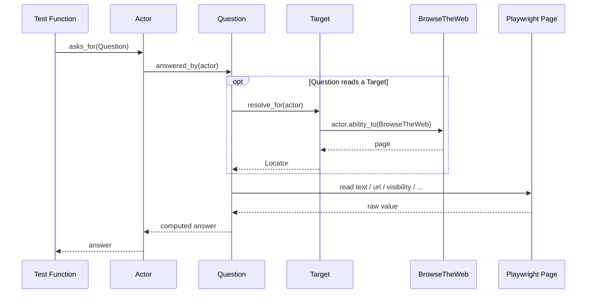
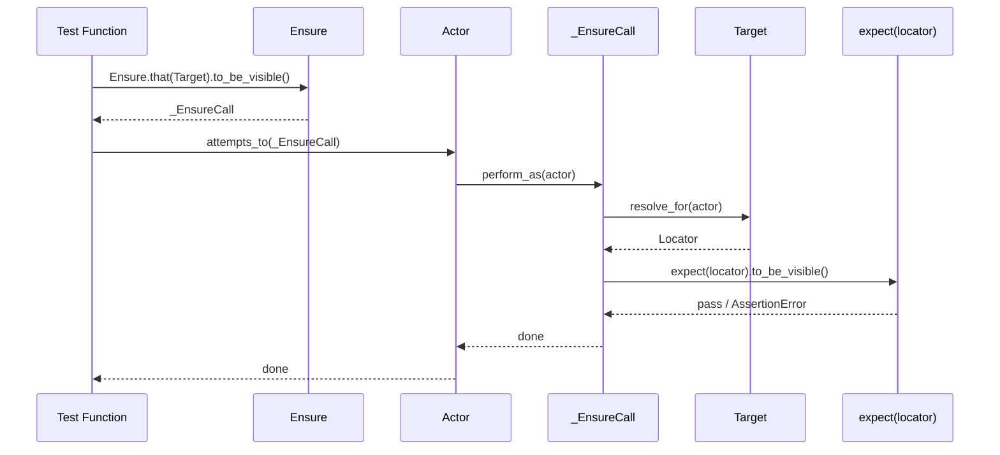
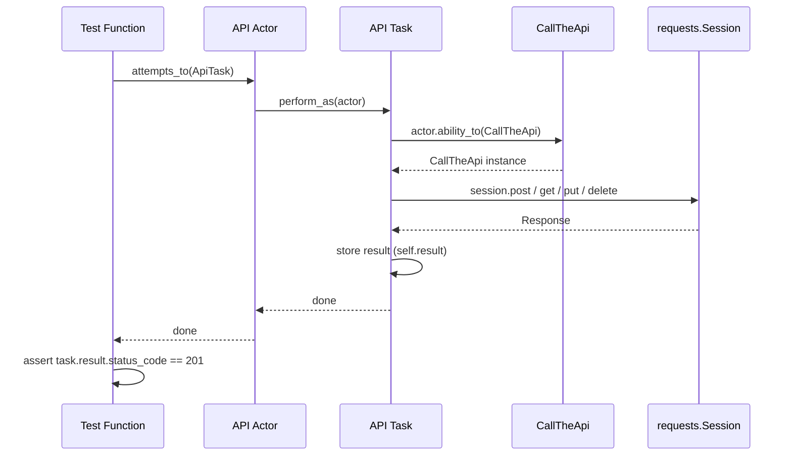
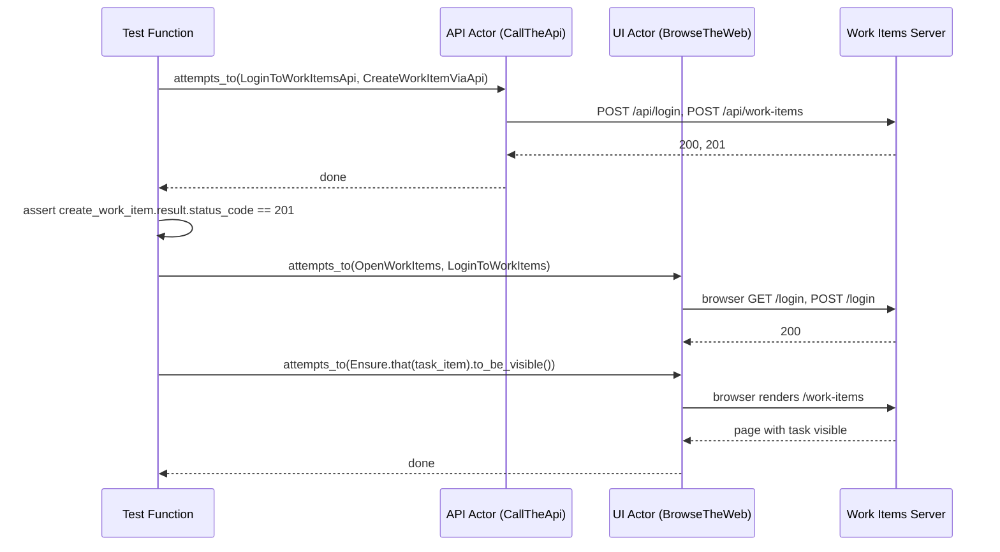

# Framework Architecture

This document is a deep-dive reference for the framework. It covers:

- the layered system architecture
- the core class hierarchy and dependencies
- how `Ensure` is implemented internally
- runtime execution sequences for each activity type
- architectural rules and the directory-to-responsibility map

---

## 1. Layered System Architecture

The framework is a strict 4-layer stack. Arrows show dependency direction (upper layers
depend on lower layers; lower layers never import from above).



| Layer | Responsibility |
|---|---|
| **Test layer** | Describes behavior — no `page`, `locator`, or `expect()` calls |
| **Example target layer** | App-specific vocabulary: Tasks, Questions, Targets, API clients |
| **Screenplay core** | Reusable building blocks split into `core/` (pure abstractions), `playwright/` (Playwright extension), and `http/` (HTTP extension) |
| **Runtime** | Playwright drives the browser; `requests` makes HTTP API calls |

---

## 2. Core Class Hierarchy



**Key points:**

- `Activity` is the abstract base. Everything the actor executes inherits from it.
- `Task` and `Interaction` both extend `Activity`; Tasks compose Interactions.
- `Consequence` extends `Activity`; `_EnsureCall` is the only built-in Consequence implementation.
- `Question` is separate from `Activity` — it returns a value rather than performing a side effect.
- An actor can hold multiple abilities. `ability_to()` resolves by exact class or base-class match.
- `_EnsureTargetBuilder` is an internal intermediate object; it is never used directly in tests.

---

## 3. The `Ensure` Implementation

`Ensure` is the most non-obvious part of the framework. Understanding it requires following
the construction chain before any actor is involved.

### Construction chain



`Ensure.that(target).to_be_visible()` is a two-step construction. The result is a
`_EnsureCall` object — a `Consequence` — that can be passed to `actor.attempts_to()`.

### Execution chain

```
actor.attempts_to(_EnsureCall)
  → _EnsureCall.perform_as(actor)
      ↓
  1. locator = target.resolve_for(actor)       # BrowseTheWeb.page → Playwright Locator
  2. assertion = expect(locator)               # Playwright assertion factory
  3. method = getattr(assertion, method_name)  # e.g. to_be_visible
  4. method(*args, **kwargs)                   # execute; raises on failure
```

### Why the cast to `LocatorAssertions`

`Ensure.that()` returns `_EnsureTargetBuilder` but declares its return type as
`LocatorAssertions`. This is a deliberate lie to the type checker. It lets IDEs offer full
Playwright assertion autocompletion (`.to_be_visible()`, `.to_have_text()`, etc.) while the
actual runtime object is the dynamic `_EnsureTargetBuilder`. The pattern is a pragmatic
trade-off: dynamic dispatch at runtime, static autocomplete in the IDE.

---

## 4. Runtime Sequences

### 4.1 Task and Interaction



### 4.2 Question



### 4.3 Ensure Consequence



### 4.4 API Task with `CallTheApi`



The API actor uses `CallTheApi` instead of `BrowseTheWeb`. There is no `Target` or
Playwright involvement. API Tasks store their response in `self.result` so tests can
inspect status codes and payloads after `attempts_to()` returns.

### 4.5 Hybrid test: two actors



Two independent actors — one with `CallTheApi`, one with `BrowseTheWeb` — operate against
the same server in a single test. They share no state; the test coordinates them.

---

## 5. Architectural Rules

- **Test files stay thin.** Tests express behavior using Tasks, Consequences, and Questions.
  No `page`, `locator`, or `expect()` calls appear in test code.
- **`actor.attempts_to()` accepts only `Task | Consequence`.** Passing an `Interaction`
  directly raises `TypeError`. This is enforced at runtime in `Actor.attempts_to()`.
- **Interactions live inside Tasks.** They are dispatched through
  `Task.perform_interactions()` → `Actor._attempts_to_interactions()`, never called
  directly by tests.
- **Target resolution flows through an Ability.** `Target.resolve_for(actor)` always goes
  through `actor.ability_to(BrowseTheWeb)`. There is no direct `page` access outside of
  Interactions and `BrowseTheWeb`.
- **Tasks may compose other Tasks or Consequences** by calling `actor.attempts_to(...)`
  inside `perform_as()`. This is the only supported nesting pattern.
- **Questions return values; they do not assert.** Use `Ensure` for Playwright-backed UI
  assertions. Use `Question` + `assert` for value-based checks.

---

## 6. Directory-to-Responsibility Map

| Directory | Responsibility |
|---|---|
| `screenplay_core/core` | Runtime-agnostic abstractions — zero external dependencies: `Activity`, `Task`, `Interaction`, `Consequence`, `Question`, `Actor`. |
| `screenplay_core/playwright` | Playwright extension: `Target` (locator recipe), `BrowseTheWeb` (page wrapper), `Ensure` (`expect()` DSL adapter). |
| `screenplay_core/playwright/interactions` | Reusable low-level browser actions: `Click`, `Fill`, `NavigateTo`, `PressKey`, `ScrollIntoView`, etc. |
| `screenplay_core/playwright/questions` | Generic read-model queries reusable across domains: `TextOf`, `CurrentUrl`, `IsVisible`, `AttributeOf`, etc. |
| `screenplay_core/http` | HTTP extension: `CallTheApi` (requests session wrapper). |
| `examples/saucedemo/ui/pages` | Page-level Target catalogs for SauceDemo (one class per page). |
| `examples/saucedemo/ui/components` | Shared Targets used across multiple SauceDemo pages. |
| `examples/saucedemo/tasks` | SauceDemo business Tasks: `Login`, `Logout`, `AddProductToCart`, `CompleteCheckout`, etc. |
| `examples/saucedemo/questions` | SauceDemo Questions: inventory state, totals, login page state. |
| `examples/work_items/app` | Flask app-under-test: routes, SQLite db, seed data. |
| `examples/work_items/automation/ui` | `WorkItemsTargets` — all `data-testid` and `data-work-item-id` selectors for Work Items. |
| `examples/work_items/automation/tasks` | Work Items UI Tasks (`CreateWorkItem`, `EditWorkItem`, `DeleteWorkItem`, …) and API Tasks (`CreateWorkItemViaApi`, `LoginToWorkItemsApi`, …). |
| `examples/work_items/automation/questions` | Work Items Questions: work item visibility, completion state, flash messages, API-based lookups. |
| `examples/work_items/automation/api` | Work Items API helper layer built on top of `CallTheApi`. |
| `tests/conftest.py` | Shared browser launch option overrides (applies to all test suites). |
| `tests/saucedemo/conftest.py` | `customer` actor fixture and `base_url` normalization for SauceDemo. |
| `tests/saucedemo/features` | Gherkin feature files for SauceDemo pytest-bdd suites. |
| `tests/saucedemo/test_*.py` | SauceDemo pytest and pytest-bdd test suites. |
| `tests/work_items/conftest.py` | Work Items session-scoped server lifecycle, per-test data reset, and actor fixtures (`work_items_customer`, `work_items_logged_in_customer`, `work_items_api_actor`). |
| `tests/work_items/features` | Gherkin feature files for Work Items pytest-bdd suites. |
| `tests/work_items/test_*.py` | Work Items UI, API, hybrid, and BDD test suites. |
