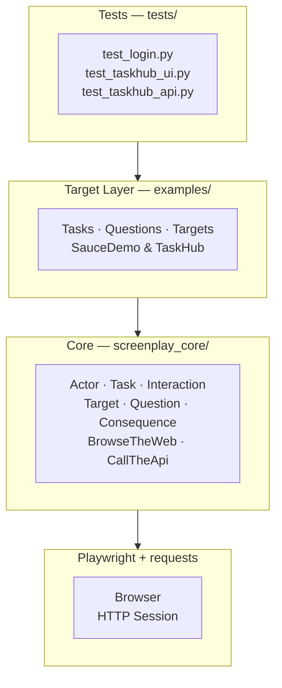
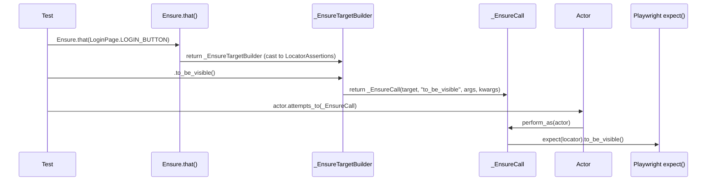
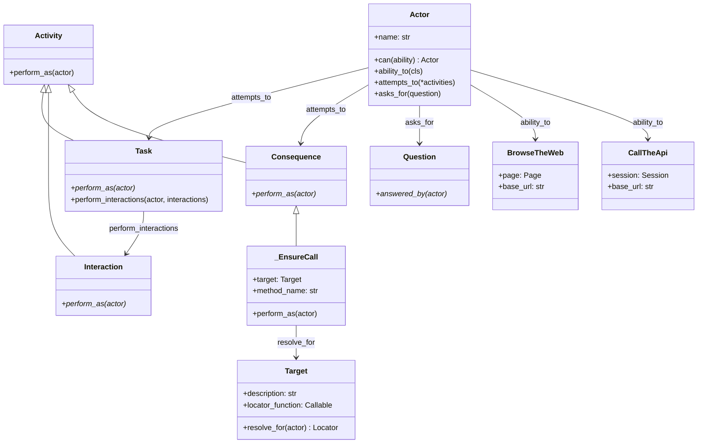
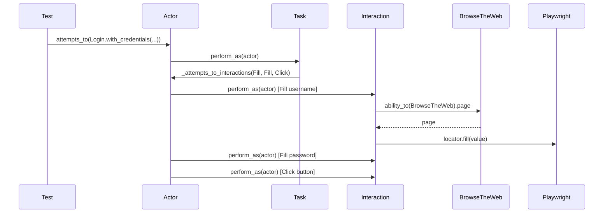
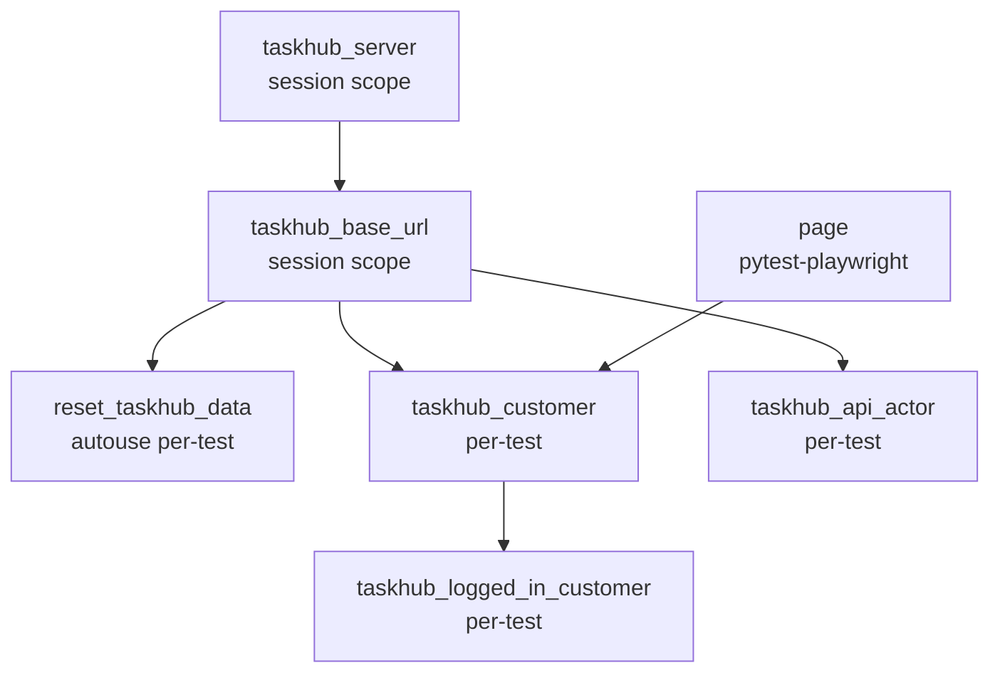

# Playwright + Pytest Screenplay Framework — Presentation Guide

> **How to use this document**
> Each section maps to one slide. The *Slide content* block is what goes on screen.
> The narrative beneath it is what you say — written as connected prose, not bullet prompts.
> Someone reading this document without the slides can follow the full story.

---

## 1. Opening — What Problem Are We Solving?

**Slide content**
```
Test automation breaks down at scale.

The problem is not writing tests.
The problem is maintaining them.
```

**Narrative**

Every test automation project starts the same way. You write a few tests, they pass, and everything looks fine. Then the application changes, a selector breaks, and suddenly twenty tests fail — all because one button got a new class name. You spend your afternoon fixing tests instead of finding bugs.

The deeper problem is architectural. Most automation frameworks couple tests directly to the browser. When the UI changes, tests change. When you want to reuse a login flow across fifteen tests, you copy and paste it. Duplication spreads. Maintenance cost compounds.

The Page Object Model was the industry's answer to this. Page Objects give you a layer of abstraction over UI elements. But they leak implementation details — you still see `click`, `fill`, `send_keys` in your tests. And they give you no guidance on how to model *behaviour*, only *structure*.

This project implements a different approach: the **Screenplay Pattern**.

---

## 2. The Screenplay Pattern — Core Idea

**Slide content**
```
Instead of "what does the page look like",
ask "what does the user do?"

  Actor  →  performs  →  Tasks
  Actor  →  asks for  →  Answers
  Actor  →  ensures   →  Consequences
```

**Narrative**

The Screenplay Pattern was introduced by Antony Marcano and popularised by Jan Molak in the Serenity/JS ecosystem. It reframes automated tests around the *user* rather than the *page*.

Three concepts drive everything:

An **Actor** represents a person using the system. In a test, the actor is the test user. An actor has *Abilities* — the tools it needs to do its job. A browser-facing actor gets the `BrowseTheWeb` ability. An API-facing actor gets `CallTheApi`.

A **Task** is a named business action. "Login", "Create a task", "Add item to cart" — these are tasks. Tasks are composed of low-level Interactions like clicking and filling fields, but tests never see those directly.

A **Consequence** is an assertion. Rather than calling `expect()` directly in the test, the actor *ensures* that something is true — keeping assertions inside the same activity flow.

The result is tests that read like acceptance criteria, not browser automation scripts.

---

## 3. A Test in Plain English

**Slide content**
```python
def test_login_happy_path(customer) -> None:
    customer.attempts_to(
        OpenSauceDemo.app(),
        Ensure.that(LoginPage.LOGIN_BUTTON).to_be_visible(),
        Login.with_credentials("standard_user", "secret_sauce"),
        Ensure.that(InventoryPage.INVENTORY_CONTAINER).to_be_visible(),
        Logout(),
        Ensure.that(LoginPage.LOGIN_BUTTON).to_be_visible(),
    )
```

**Narrative**

Here is a complete test. Read it out loud and it sounds like a test case written in plain English: open the app, check the login button is visible, log in, check the inventory loaded, log out, check we're back on the login page.

There are no `page.locator()` calls. No `expect()`. No `click()`. No `fill()`. The test describes *behaviour*. The tasks below it implement *how* that behaviour is executed. If the login form changes — different selectors, different flow — only the `Login` task needs to change. The test stays the same.

This is the key design insight: behaviour is stable; implementation is not. Screenplay forces you to put volatile implementation details where they belong, hidden inside Tasks.

---

## 4. Project Structure — What We Built

**Slide content**
```
Two fully working example targets:

  SauceDemo  — external public e-commerce app
  TaskHub    — local Flask app built from scratch

On top of a reusable framework core.
```

**Narrative**

This project ships three things.

First, a reusable **Screenplay core** in `screenplay_core/`. It is split into `core/` for the runtime-agnostic abstractions, `playwright/` for the browser extension classes (`Target`, `BrowseTheWeb`, `Ensure`) plus the `interactions/` and `questions/` subpackages, and `http/` for `CallTheApi`.

Second, two **example targets** in `examples/`. SauceDemo is a public-facing e-commerce demo site used by the automation community. TaskHub is a local Flask application with a web UI, a JSON REST API, an SQLite database, and test utility endpoints — built specifically to demonstrate realistic automation scenarios.

Third, a **test suite** in `tests/` — eighty tests across SauceDemo and TaskHub covering UI, API, hybrid, and BDD scenarios.

The important thing is that the framework knows nothing about the examples, and the examples know nothing about each other. The Screenplay core is genuinely reusable.

---

## 5. The Four-Layer Stack

**Slide content**



**Narrative**

The architecture has four layers, each with a single responsibility.

At the top, **tests** describe behaviour. They import Tasks and Targets from the example target layer and compose them into scenarios. A test file should be so thin that a product manager could read it.

The **target layer** is where application-specific knowledge lives. Tasks implement behaviour for SauceDemo or TaskHub. Targets define which UI elements matter and how to find them. Questions answer questions about the application state. This layer knows everything about the app; the test layer knows nothing.

The **Screenplay core** is the framework. It defines the rules — what an Actor can do, what a Task must implement, what a Consequence means. It enforces layer boundaries at runtime. It knows nothing about any specific application.

At the bottom, **Playwright and requests** do the actual work — driving the browser and making HTTP calls. The core wraps these through Abilities and never exposes them directly to tests.

Dependencies only flow downward. Tests cannot import from the core directly. The core cannot import from examples. These constraints are enforced.

---

## 6. The Actor — Runtime Engine

**Slide content**
```python
actor = Actor("Customer").can(BrowseTheWeb.using(page, base_url=base_url))

actor.attempts_to(
    Login.with_credentials("standard_user", "secret_sauce"),
    Ensure.that(InventoryPage.INVENTORY_CONTAINER).to_be_visible(),
)

name = actor.asks_for(TextOf(InventoryPage.PRODUCT_NAME))
```

**Narrative**

The Actor is the runtime engine of the framework. Three methods do everything.

`.can(ability)` registers a capability. The actor now holds a reference to a Playwright page wrapped in `BrowseTheWeb`, or a requests Session wrapped in `CallTheApi`. Abilities are retrieved by class — `actor.ability_to(BrowseTheWeb)` — with base-class resolution and an `AmbiguousAbilityError` guard if two abilities share a parent class.

`.attempts_to(*activities)` executes a sequence of Tasks and Consequences. Crucially, it rejects raw Interactions at the boundary — if you pass a `Click()` directly, you get a `TypeError` explaining that `attempts_to()` accepts Tasks and Consequences only, and that Interactions belong inside Tasks. This is not a convention; it is enforced at runtime.

`.asks_for(question)` evaluates a Question and returns an answer. `TextOf`, `CurrentUrl`, `IsVisible`, `TaskIdForTitle` — all of these return values that tests can assert against.

Every activity is logged with its name, duration in milliseconds, and success or failure. This makes debugging a failing CI run straightforward.

---

## 7. Targets — Lazy Locator Recipes

**Slide content**
```python
# Defined once, resolved lazily
class LoginPage:
    LOGIN_BUTTON = Target(
        "Login button",
        lambda page: page.locator('[data-test="login-button"]')
    )
    LOGIN_ERROR = Target(
        "Login error message",
        lambda page: page.locator('[data-test="error"]')
    )
```

**Narrative**

A Target is a named, lazy locator recipe. It stores *how* to find an element — a lambda that takes a Playwright page and returns a Locator — but it does not store the element itself. Resolution happens at runtime, inside the actor context, when the test actually runs.

This means Targets are safe to define as class-level constants. No page needs to exist when the class is imported. No browser needs to be open. The lambda is a closure that captures the selector logic, and `target.resolve_for(actor)` calls it when needed.

Because Targets have human-readable descriptions — "Login button", "Login error message" — error messages and test logs are readable without decoding selectors. When an assertion fails, the log reads `Ensure(target='Login button', assertion='to_be_visible')` — not `expect(page.locator('[data-test="login-button"]')).to_be_visible()`.

---

## 8. The Ensure DSL — Playwright Assertions in Screenplay Style

**Slide content**
```python
# In tests:
actor.attempts_to(
    Ensure.that(LoginPage.LOGIN_ERROR).to_contain_text("Username is required"),
    Ensure.that(InventoryPage.INVENTORY_CONTAINER).to_be_visible(),
    Ensure.that(CartPage.CART_ITEM_NAMES).to_have_count(2),
)

# At runtime this calls:
#   expect(locator).to_contain_text("Username is required")
#   expect(locator).to_be_visible()
#   expect(locator).to_have_count(2)
```

**Narrative**

Playwright's `expect()` assertions have excellent auto-waiting and retry behaviour built in. The challenge is exposing them through the Screenplay pattern, which requires everything the actor does to be a Task or Consequence.

`Ensure.that(target)` returns an `_EnsureTargetBuilder` — but type-cast to `LocatorAssertions` for the IDE. This means your IDE offers full autocomplete for every Playwright assertion method: `to_be_visible`, `to_have_text`, `to_contain_text`, `to_have_count`, and so on. When you call one of those methods, Python's `__getattr__` intercepts it and returns an `_EnsureCall` object — a Consequence that the actor can execute.

When the actor runs it, `_EnsureCall.perform_as()` resolves the Target to a Playwright Locator, calls `expect(locator)`, looks up the assertion method by name, and invokes it. The full Playwright assertion power — retry logic, timeout, readable failure messages — is preserved without any wrapper code.

This is a pragmatic trade-off: dynamic dispatch at runtime, static autocomplete in the IDE. The type checker is given a white lie; the developer gets a usable API.



---

## 9. Tasks — Business Behaviour as Reusable Code

**Slide content**
```python
class Login(Task):
    """Task: fill credentials and submit the login form."""

    def perform_as(self, actor) -> None:
        self.perform_interactions(
            actor,
            Fill(LoginPage.LOGIN_USERNAME, self.username),
            Fill(LoginPage.LOGIN_PASSWORD, self.password),
            Click(LoginPage.LOGIN_BUTTON),
        )

    @classmethod
    def with_credentials(cls, username: str, password: str) -> "Login":
        return cls(username, password)
```

**Narrative**

A Task implements a named business action. The `perform_as(actor)` method is the contract every task must fulfil. Inside it, low-level Interactions — `Fill`, `Click`, `NavigateTo`, `SelectByValue` — are dispatched through `self.perform_interactions(actor, ...)`.

`perform_interactions` routes through `actor._attempts_to_interactions()` — a separate internal method that accepts only Interactions. This is the mechanism that keeps Interactions out of tests while making them available inside Tasks.

Factory class methods like `.with_credentials()` provide a fluent, readable construction API. The test reads `Login.with_credentials("standard_user", "secret_sauce")` — a complete sentence. The Task holds the implementation details.

Tasks compose. A task can call `actor.attempts_to(OtherTask())` inside `perform_as` to build complex workflows from simpler ones. `OpenTaskHub.app()` navigates to the base URL. `LoginToTaskHub.with_credentials()` fills and submits the form. A logged-in fixture calls both.

---

## 10. Two Abilities — One Actor Can Do Both

**Slide content**
```python
# UI actor
Actor("Customer").can(
    BrowseTheWeb.using(page, base_url=base_url)
)

# API actor
Actor("API Client").can(
    CallTheApi.at(base_url)
)

# Hybrid actor (same actor, two abilities)
Actor("Automation").can(
    BrowseTheWeb.using(page, base_url=base_url)
).can(
    CallTheApi.at(base_url)
)
```

**Narrative**

The framework ships two Abilities.

`BrowseTheWeb` wraps a Playwright page. It stores the page reference and a base URL, and it exposes the page to Interactions and Targets via `actor.ability_to(BrowseTheWeb).page`.

`CallTheApi` wraps a requests Session. It stores a base URL and exposes HTTP helper methods — `get`, `post`, `put`, `delete` — with sensible defaults for headers, timeouts, and URL construction. After each test, the session is closed through the fixture teardown.

Because `ability_to()` resolves by class, an actor can hold both abilities simultaneously. A hybrid test can call `actor.attempts_to(SomeUiTask())` and immediately call `actor.asks_for(SomeApiQuestion())` on the same actor, switching between browser and HTTP seamlessly.

---

## 11. Hybrid Tests — Where UI and API Cross Boundaries

**Slide content**
```python
def test_create_task_via_api_verify_in_ui(
    taskhub_api_actor, taskhub_customer
) -> None:
    # API actor creates a task
    create_task = CreateTaskViaApi.with_payload({"title": "Hybrid task", "priority": "HIGH"})
    taskhub_api_actor.attempts_to(
        LoginToTaskHubApi.with_credentials("admin", "admin123"),
        create_task,
    )
    assert create_task.result.status_code == 201

    # UI actor verifies it appears in the browser
    taskhub_customer.attempts_to(
        OpenTaskHub.app(),
        LoginToTaskHub.with_credentials("admin", "admin123"),
        Ensure.that(TaskHubTargets.task_item_for_id(create_task.task_id)).to_be_visible(),
    )
```

**Narrative**

Hybrid tests are the most powerful feature of a dual-ability framework, and they are the hardest pattern to demonstrate in a Page Object Model world.

In this test, two actors work together. The API actor logs in through the REST API and creates a task, bypassing the browser entirely. This is fast and deterministic — no UI interaction required to set up state. The UI actor then opens a browser, logs in through the web interface, and verifies the task is visible in the rendered task list.

The test proves two things simultaneously: the API created the resource correctly, and the UI renders it correctly. It could not pass if either layer was broken.

The reverse pattern also exists: the UI actor creates a task through the browser form, and the API actor then queries the REST endpoint to verify the task was persisted with the correct fields. Both directions are tested.

This kind of cross-boundary test is what distinguishes framework design from test scripting. It requires deliberate architectural choices — separate actors, separate abilities, clean fixture isolation — that are not accidents.

---

## 12. TaskHub — A Real App-Under-Test

**Slide content**
```
Flask + SQLite web application
built specifically to demonstrate realistic automation.

Routes:
  GET  /login       /tasks       /health
  POST /api/login   /api/tasks
  PUT  /api/tasks/<id>
  DEL  /api/tasks/<id>
  POST /api/test/reset   /api/test/seed
```

**Narrative**

SauceDemo is an external site the automation community uses as a shared practice target. It is good for demonstrating UI automation, but it cannot show API testing, hybrid tests, or server lifecycle management because you do not control it.

TaskHub solves that. It is a Flask application with an SQLite database, written from scratch for this project. The web UI uses `data-testid` and `data-task-id` attributes on every interactive element — stable selectors that do not break when styling changes. The REST API accepts and returns JSON.

Two special endpoints make testing clean. `POST /api/test/reset` drops all tasks and re-seeds a fixed baseline dataset. `POST /api/test/seed` adds a deterministic set of tasks from a fixture file. These endpoints run before every test, ensuring complete test isolation with zero shared state.

The test infrastructure starts TaskHub automatically. A session-scoped pytest fixture finds a free port, launches the Flask process as a subprocess, polls `/health` until the server is ready, and then yields the base URL to all tests in the session. On teardown, the process is terminated cleanly. Tests never need to start the server manually.

---

## 13. BDD — Gherkin Scenarios Wired to Screenplay Steps

**Slide content**
```gherkin
@integration @ui
Scenario: Create a task and verify it appears in the list
  Given I am logged in to TaskHub
  When I create a TaskHub task titled "BDD created task" with priority "HIGH"
  Then the TaskHub task titled "BDD created task" should be visible

Scenario: Delete a task and verify it is removed
  Given I am logged in to TaskHub
  When I create a TaskHub task titled "BDD task to delete" with priority "LOW"
  And I delete the TaskHub task titled "BDD task to delete"
  Then the TaskHub task titled "BDD task to delete" should not be visible
```

**Narrative**

The project includes BDD scenarios using pytest-bdd with Gherkin feature files. The four TaskHub scenarios cover login, task creation, task completion with filtering, and task deletion.

What makes this integration clean is that the step definitions are thin — they do nothing except call Screenplay tasks. The `When` step for creating a task calls `CreateTask.named(title=title, priority=priority)`. The `Then` step calls `TaskIdForTitle(title)` to find the task and `Ensure.that(...).to_be_visible()` to assert it. No locator logic, no `page.click()` — the step definitions compose the same Tasks that the regular tests use.

This means there is no code duplication between BDD and non-BDD tests. Adding a Gherkin scenario does not require reimplementing existing behaviour. The Screenplay task library is shared across all test styles.

---

## 14. CI/CD Pipeline

**Slide content**
```
lint (ruff + black)
  ↓
tests_fast  — smoke + integration + ui + api + hybrid
  ↓ (on schedule / manual)
full_matrix — Ubuntu × Windows × Chromium × Firefox
```

**Narrative**

The GitHub Actions pipeline has three stages.

The **lint** stage runs ruff for static analysis and black for formatting. If either fails, the pipeline stops. This prevents formatting drift and catches common errors before any test runs.

The **tests_fast** stage runs the full test marker union — smoke, integration, ui, api, hybrid — on Ubuntu with Chromium. This is the gate for every push and pull request. It also uploads a coverage report to Codecov, so code coverage is visible on every PR.

The **full matrix regression** runs on a schedule and on manual trigger, not on every push. It tests four combinations: Ubuntu/Chromium, Ubuntu/Firefox, Windows/Chromium, Windows/Firefox. This catches browser-specific and OS-specific failures without adding cost to every developer commit.

On failure, screenshots, traces, HTML reports, and JUnit XML are uploaded as artifacts. When a test fails in CI, the trace file can be opened in the Playwright Trace Viewer to replay the test step-by-step and inspect the DOM at each point — no need to reproduce the failure locally.

---

## 15. What This Demonstrates

**Slide content**
```
Framework design    →  not just test writing
Layer enforcement   →  architectural discipline
Dual-ability actors →  UI + API in one test
BDD integration     →  business-readable scenarios
Server lifecycle    →  production-grade infrastructure
CI/CD              →  lint, coverage, multi-browser matrix
Documentation      →  architecture, design decisions, onboarding guide
```

**Narrative**

Any QA engineer can write a test. This project is designed to show more than that.

Designing a framework means making decisions about where knowledge lives, how layers communicate, and what constraints to enforce. The Screenplay Pattern enforces a strict boundary: tests describe behaviour, tasks implement behaviour, and the framework enforces that boundary at runtime with informative error messages — not as a convention that someone might ignore.

Dual-ability actors and hybrid tests require thinking about test infrastructure as a distributed system — two clients, one server, assertions that cross boundaries.

Building TaskHub alongside the automation shows that the engineer can think about testability from both sides: how to design an application that is easy to automate reliably, and how to automate it once it is built.

The documentation — architecture diagrams, design decision Q&A, getting-started walkthrough — reflects production-team thinking: other people will work with this code, and they need to understand it.

The test suite ships with coverage reporting, a three-stage CI pipeline, BDD scenarios, parametrised login tests, actor strictness tests, and hybrid tests. This is the full picture of what production automation looks like.

---

## Appendix — Quick Reference

### Class hierarchy



### Runtime sequence — Task execution



### Fixture dependency graph (TaskHub)



### Test count by suite

| Suite | Tests | Type |
|---|---|---|
| `tests/saucedemo/test_login.py` | 8 | UI + parametrized |
| `tests/saucedemo/test_inventory.py` | 8 | UI |
| `tests/saucedemo/test_product_details.py` | 9 | UI |
| `tests/saucedemo/test_checkout_*.py` | 13 | UI |
| `tests/saucedemo/test_ui_pages.py` | 7 | UI |
| `tests/saucedemo/test_actor_strictness.py` | 7 | Framework unit |
| `tests/saucedemo/*_bdd.py` | 7 | BDD |
| `tests/taskhub/test_taskhub_ui.py` | 8 | UI |
| `tests/taskhub/test_taskhub_api.py` | 7 | API |
| `tests/taskhub/test_taskhub_hybrid.py` | 2 | Hybrid |
| `tests/taskhub/test_taskhub_bdd.py` | 4 | BDD |
| **Total** | **80** | |

### Key files to read in order

1. [tests/saucedemo/test_login.py](../tests/saucedemo/test_login.py) — smallest complete Screenplay test
2. [screenplay_core/core/actor.py](../screenplay_core/core/actor.py) — how the actor runs activities
3. [examples/saucedemo/tasks/login.py](../examples/saucedemo/tasks/login.py) — Task implementation
4. [screenplay_core/playwright/ensure.py](../screenplay_core/playwright/ensure.py) — the Ensure DSL
5. [tests/taskhub/test_taskhub_hybrid.py](../tests/taskhub/test_taskhub_hybrid.py) — cross-boundary tests
6. [tests/taskhub/test_taskhub_bdd.py](../tests/taskhub/test_taskhub_bdd.py) — BDD steps
7. [tests/taskhub/conftest.py](../tests/taskhub/conftest.py) — server lifecycle and fixture design
