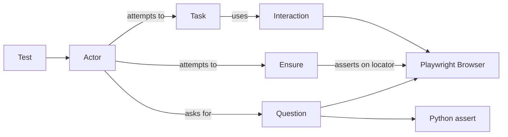
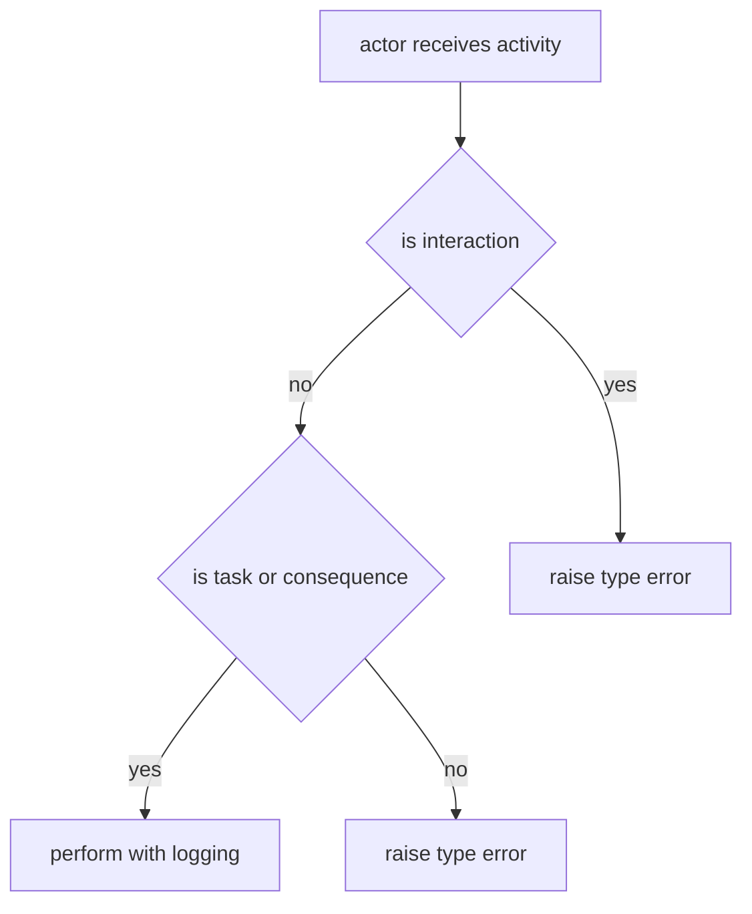
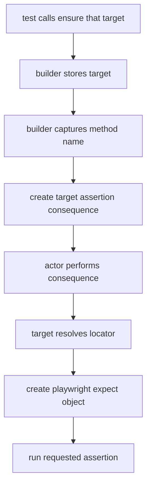
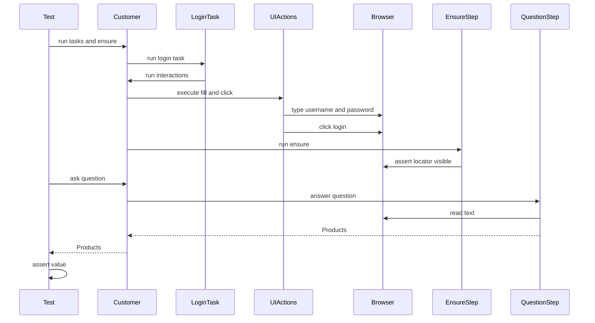

# Strict Screenplay (For Dummies, But Accurate)

This file explains how this framework works **now**, after strict enforcement.
It is intentionally verbose and practical.

## 1. The Big Idea in One Minute

You can think of this framework like a small team:

- `Actor` = the person doing things (`customer`)
- `Task` = a business action ("log in", "begin checkout")
- `Interaction` = low-level UI moves ("click", "fill", "wait")
- `Question` = read data from the app ("what is the title?", "how many items?")
- `Ensure` = UI assertion using Playwright `expect(locator)`
- `assert` = Python assertion for values returned by `Question`

Strict rule:

- Tests call `customer.attempts_to(...)` with only `Task` and `Consequence` (for example, `Ensure`).
- Tests never pass raw `Interaction` into `attempts_to(...)`.
- Tasks are where interactions happen.

## 2. The Contract (What Goes Where)

| Tool | Purpose | Where it belongs |
|---|---|---|
| `Task` | Business action | In tests and inside other tasks |
| `Interaction` | Click/type/select/wait/etc | Inside tasks only |
| `Consequence` | Verification activity | In `customer.attempts_to(...)` |
| `Question` | Return value/data | In `customer.asks_for(...)` |
| `Ensure` | UI assertion with Playwright | In `customer.attempts_to(...)` |
| `assert` | Value assertion | In tests against `asks_for(...)` result |

## 3. Runtime Flow (High-Level)



## 4. Strict Enforcement: What `Actor.attempts_to()` Does

`Actor.attempts_to()` is now guarded:

- Accepts only `Task` and `Consequence` (`Ensure` is a consequence).
- Rejects `Interaction` directly with a `TypeError`.
- Keeps logging around all activities.

Code location:

- `screenplay_core/core/actor.py`

Enforcement logic:



## 5. How Tasks Execute Interactions Now

Tasks no longer call `actor.attempts_to(Click(...))` directly.

Instead, tasks call:

```python
self.perform_interactions(actor, Click(...), Fill(...))
```

That helper routes to actor internal interaction execution:

- `Task.perform_interactions(...)` -> `Actor._attempts_to_interactions(...)`

This preserves layering:

- test level = business intent
- task level = UI mechanics
- task composition is still allowed (`Task` can call other `Task`s)

## 6. How `Ensure` Works Now

`Ensure` is the UI assertion bridge between Screenplay and Playwright.

Simple mental model:

- `Ensure.that(target)` stores a `Target` in a builder object.
- When you call a method on that builder, Python `__getattr__` catches the method name.
- The builder creates a `_TargetAssertion` consequence with:
  - the target
  - the method name you called
  - args and kwargs
- Later, when the actor performs that consequence:
  - target resolves to Playwright locator
  - framework calls `expect(locator)`
  - framework calls the requested assertion method with your arguments

Important: this is currently permissive.

- We allow any `to_*` method name, then forward it to Playwright `expect(locator)`.
- If method name does not start with `to_`, `Ensure` raises an `AttributeError` early.
- That keeps API small and flexible.
- It also means typos fail at runtime, not at editor/type-check time.

So `Ensure` is not a value comparator. It is a **UI locator assertion wrapper**.

Current implementation file:

- `screenplay_core/consequences/ensure.py`

Ensure call flow:



## 7. How Questions + `assert` Work

Use `Question` when you need data:

- page title text
- current URL
- badge count
- computed totals

Pattern:

```python
assert customer.asks_for(TextOf(AppShell.PAGE_TITLE)) == "Products"
assert customer.asks_for(InventoryCount()) == 6
```

Why this is good:

- UI checks stay in `Ensure`.
- value/data checks stay in Python `assert`.
- tests remain explicit and readable.

## 8. Correct vs Incorrect Examples

Correct:

```python
customer.attempts_to(
    OpenLoginPage(),
    Login.with_credentials("standard_user", "secret_sauce"),
    Ensure.that(InventoryPage.INVENTORY_CONTAINER).to_be_visible(),
)
assert customer.asks_for(TextOf(AppShell.PAGE_TITLE)) == "Products"
```

Incorrect (blocked by strict runtime check):

```python
customer.attempts_to(
    Click(LoginPage.LOGIN_BUTTON),  # Interaction in test: not allowed
)
```

Correct Task internals:

```python
class Login(Task):
    def perform_as(self, actor):
        self.perform_interactions(
            actor,
            Fill(LoginPage.LOGIN_USERNAME, self.username),
            Fill(LoginPage.LOGIN_PASSWORD, self.password),
            Click(LoginPage.LOGIN_BUTTON),
        )
```

## 9. Sequence Diagram: Typical Login Test



## 10. Quick FAQ

Q: Why block interactions in tests?  
A: It prevents leakage of low-level selectors/actions into test code. Tests stay business-oriented.

Q: Can `Ensure` replace all asserts?  
A: No. `Ensure` is for UI locator assertions. Keep Python `assert` for plain values from `Question`.

Q: Where do locator details belong?  
A: In `Target`s under page/component modules, not in tests.

Q: Where should retries/waits live?  
A: In interactions and tasks, not scattered in tests.

## 11. Mental Checklist Before Writing a Test

1. Can this be described as a business action? Use a `Task`.
2. Need to check UI state of a locator? Use `Ensure`.
3. Need a computed/read value? Use `Question` + `assert`.
4. About to write `Click(...)` in a test? Stop. Put it inside a `Task`.

---

If you follow only one sentence, use this one:

**Tests should read like business behavior, not button choreography.**
